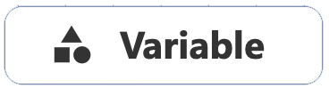
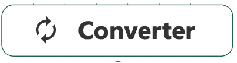
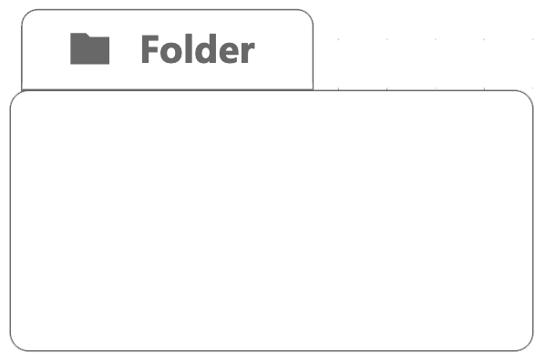

import Tabs from '@theme/Tabs';
import TabItem from '@theme/TabItem';

# Cheatsheet
<Tabs>
  <TabItem value="primitives" label="Primitives" default>

Hier findest du alle Funktionsbausteine auf einem Blick!

| Primitive     | Typ |    Bedeutung       | Beispiele |
| ----------- | ----------- |----------- | ----------- |
|   | SD     | <li>1. Akkumulierte Größen bzw. Werte, die sich im Laufe der Zeit ansammeln oder abbauen</li><li>2. Speichert aktuellen Wert zu unterschiedlichen Berechnungszeitschritten </li><li>3. Ändert sich durch Zuflüsse (Inflows) oder Abflüsse (Outflows)</li>  | Bevölkerungszahl, Wasserstand, Energieinhalt | 
|   | SD     | <li>1.Beschreiben die Geschwindigkeit, mit der sich ein Bestand aufbaut oder abbaut</li><li>2.Verändern den Stock, aber speichern selbst keine Werte</li><li>3.Können von anderen Variablen abhängen</li> | Geburtenrate, Wasserzufluss, Energieverbrauch | 
|   | Common     | <li>1.Moderner Standard des Open Geospatial Consortium (OGC)</li><li>2.Bereitstellung und Abfrage von Geodaten über Webschnittstellen </li><li>3.Datensätze aus Geoportal über das Masterportal Hamburg</li> | Volkszählungen, Bezirksdaten, Infrastruktur | 
|   | Common     | <li>1.Größenveränderliche Einflussfaktoren </li><li>2.Keine Speicherfunktion der Werte </li><li>3.Beeinflussen andere Berechnungsgrößen </li>|  | 
|   | Common     | <li>1.Führt eine Berechnung, Transformation oder Ableitung aus anderen Variablen oder Konstanten durch </li><li>2.Ähnlich wie Hilfsvariable und speichert keine Werte, sondern wird bei jeder Simulationszeit neu berechnet</li><li>3.Stellt grafisch Input-Output Relationen dar</li>|  |
|   | Common    | <li>1.Strukturgebendes Element, welches die Organisation eines Modells vereinfacht</li><li>2.Ausgewählte Modellteile können gesammelt, gruppiert und bewegt werden </li>|  |
|   | ABM     | <li>1.Bezeichnet Zustand von aktueller Situation oder Konfiguration eines Agenten, die sein Verhalten beeinflusst </li><li>2.Wechseln von einem State in einen anderen, ausgelöst durch Regeln, Wahrscheinlichkeiten oder Umwelteinflüsse </li>| Zuhause, Auf der Arbeit, In Quarantäne |
|   | ABM     | <li>1.Bezeichnen Übergänge zwischen den Zuständen eines Agenten </li><li>2.Wann und unter welchen Bedingungen soll Agent von einem Zustand in einen anderen wechseln?</li>| Von gesund zu infiziert, von unentschlossen zu überzeugt, Umzug in eine andere Stadt |
|   | ABM     | <li>1.Konkrete Handlungen, die ein Agent während eines Zustandes oder bei einem Zustandswechsels (Transitions) ausführt </li><li>2.Beschreiben operationale Verhaltensregeln, wie beispielsweise sich bewegen, mit anderen Agenten interagieren, Ressourcen verbrauchen etc. </li>| sich impfen lassen, Nächste Fahrradstation suchen, Andere Agenten beeinflussen |
|   | ABM     | <li>1.Ist autonome Entität, die eigene Zustände, Eigenschaften und Verhaltensregeln besitzt </li><li>2.Kann mit ihrer Umwelt und anderen Agenten interagieren </li><li>3.Können eigenständige Entscheidungen treffen, zustandsabhängig handeln, sich verändern und lokal interagieren</li>| Auto im Straßenverkehr, Konsument im Markmodell, Maschine in einer Fabrik |
|   | ABM     | <li>1.Gesamtheit aller Agenten eines bestimmten Typs innerhalb eines Modell </li><li>2.Kollektive Menge an Agenten haben gemeinsame Eigenschaften oder Verhaltenstypen </li>| Bewohner in einer Stadt, Fahrzeuge auf einer Straße, Bäume im Quartier |
  </TabItem>
  <TabItem value="interface" label="Interface">
  Hier findest du alle Interface-Komponenten auf einem Blick!
| Interface    | Komponent |    Funktionen       | 
| ----------- | ----------- |----------- |
|   | **Navibar**    | <li>1. Zurück zum Homescreen</li><li>2. Liste meiner Modelle</li><li>3. Liste öffentlicher Modelle</li><li>4. Rechtliche Dokumente</li><li>5. Übersetzung(DE/EN)</li><li>6. Benutzerkontoname</li><li>7. Abmeldung</li>
|   | Meine Modelle   | <li>1. Suchfunktion</li><li>2. Filterfunktion</li><li>3. Neues Modell erstellen</li><li>4. Modell öffnen</li><li>5. Modellname & -Beschreibung bearbeiten</li><li>6. Modell löschen</li>
|   | **Sidebar**    | <li>1. Modellinformationen</li><li>2. Szenario-Einstellungen</li><li>3. Versions-Einstellungen</li><li>4. Modell-Einstellungen</li>
|   | Modell Einstellungen    | <li>1. Start des Simulationszeitraums</li><li>2. Länge des Simulationszeitraums</li><li>3. Zeitintervalle</li><li>4. Einheit der zeitlichen Dimension</li><li>5. Berechnungsalgorithmus</li><li>6. Globals & Makros</li>
|   | Modell klonen     | <li>1. Neuer Modellname</li>
|   | Modell teilen    | <li>1. E-Mailadresse des Empfängers</li><li>2. Zugeteilte Rolle</li>
|   | Modell veröffentlichen    | <li>1. Versionstyp</li><li>2. Veröffentlichung als Modelserver Endpunkt</li><li>3. Notizen</li>
|   | **Activebar**    | <li>1. Primitives</li><li>2. Simulation durchführen</li>
|   | Primitives     | <li>1. 11 Funktionsbausteine</li><li>2. Anpinnen-Funktion</li>
|   | Simulationsergebnisse     | <li>1. Anzeige der Simulationsergebnisse in Linien- oder Streudiagramm</li><li>2. Anpinnen-Funktion</li><li>2. Geschwindigkeits-Einstellungen</li>
 | Canvas |  <li>1. Arbeitsoberfläche für die Platzierung der Primitives</li><li>2. Primitives grafisch verbinden/Geistervariablen erstellen/löschen</li>
|   | Primitive-Einstellungsfenster    |  <li>1. Einstellungen des jeweiligen Primitives</li><li>2. Schnittstelle & Szenario-Einstellungen</li><li>3. Validierung</li>
|    | Szenario-Einstellungen     |  <li>1. Parameter im Primitive-Einstellungsfenster</li><li>2. Szenario-Einstellungen in der Sidebar</li>
</TabItem>
  <TabItem value="fragenkatalog" label="Fragenkatalog">
    Hier findest du eine Liste an Denkanstößen zum Thema Modellieren auf einem Blick!
   
**Vor dem Modellieren – „Model Land betreten“**

Partizipative Modellierung

* Wer wird im Modell abgebildet – und sind diese Gruppen am Modellierungsprozess beteiligt?
* Gibt es diverse Perspektiven, die mitgedacht und einbezogen werden sollten?
* Wie kann partizipative Modellierung (z. B. Co-Modelling) ethisch umgesetzt werden?
* Wer wird durch das Modell potenziell benachteiligt oder übersehen?

Modellzweck und Zieldefinition

* Welches Problem soll gelöst, welche Frage beantwortet werden?
* Ist der Zweck des Modells für alle Beteiligten klar und nachvollziehbar kommuniziert?
* Welche Entscheidungen oder Handlungen sollen auf Basis des Modells möglich werden?
* Für welchen Einsatz ist das Modell *nicht* geeignet?

Annahmen & Werturteile

* Welche Annahmen werden im Modell getroffen – und warum?
* Wo fließen normative Wertentscheidungen (z. B. durch Auswahl von Parametern) ein?
* Wie können diese dokumentiert und für Außenstehende transparent gemacht werden?
* Wie neutral oder interessengeleitet ist das Modell?

Modellgüte und -grenzen

* Wie wird sichergestellt, dass das Modell korrekt programmiert ist (Verifizierung)?
* Wie wird geprüft, ob das Modell die Realität sinnvoll abbildet (Validierung)?
* Welche Grenzen des Modells sind klar benannt?
* Werden vergangenheitsbasierte Modelle kritisch auf ihre Aussagekraft für die Zukunft geprüft?

Modell als Mitgestalter

* Inwiefern beeinflusst das Modell die Realität, die es simulieren soll?
* Welche Verantwortung ergibt sich aus dem potenziellen Einsatz eines Modells?
* Welche gesellschaftlichen Wirkungen kann das Modell entfalten – auch unbeabsichtigt?

---

**Während der Simulation – „Model Land navigieren“**

Umgang mit Unsicherheiten

* Welche Unsicherheiten sind bekannt (z. B. Datenqualität, Modellstruktur)?
* Gibt es „tiefe Unsicherheit“, d. h. grundsätzliche Unklarheit über Zusammenhänge?
* Wird offen mit diesen Unsicherheiten umgegangen – oder suggeriert das Modell Sicherheit?

Multi-Modelling und Divergenzen

* Warum wird *ein* Modell verwendet – und nicht mehrere?
* Gibt es divergierende Modellergebnisse? Wie werden diese analysiert?
* Unterstützen verschiedene Modellansätze ein besseres Verständnis?

Szenarienentwicklung

* Wird das Modell zur *Optimierung* (sichere Zukunft) oder zur *Robustheit* (unsichere Zukunft) genutzt?
* Werden ausreichend viele Szenarien simuliert, um Bandbreiten abzudecken?
* Wie werden Wahrscheinlichkeiten kommuniziert – als Prognosen oder als Möglichkeitsspektrum?

---

**Nach dem Modellieren – „Model Land verlassen“**

Veröffentlichung & Transparenz

* Werden die Modellstruktur, Parameter und Ergebnisse öffentlich zugänglich gemacht?
* Ist die Reproduzierbarkeit der Ergebnisse gewährleistet?
* Sind die Ergebnisse nachvollziehbar für andere?
* Gibt es Mechanismen für externes Feedback und wissenschaftliche Überprüfung?

Interpretation & Kommunikation

* Wie werden die Ergebnisse beschrieben – rein quantitativ oder auch qualitativ-kontextualisiert?
* Welche Narrative begleiten die Veröffentlichung der Resultate?
* Wer bereitet die Ergebnisse für Nicht-Expert\:innen auf – und mit welcher Intention?
* Wurde über Grenzen und Limitationen des Modells aufgeklärt?

Verantwortung & Vertrauen

* Wer trägt Verantwortung für die Nutzung der Modellergebnisse?
* Inwiefern beeinflusst das Vertrauen in die Modellierenden die Akzeptanz des Modells?
* Wie wird mit Fehlinterpretationen oder Fehlentscheidungen umgegangen?
* Was lernen wir aus dem Modell für zukünftige Anwendungen?
</TabItem>
   <TabItem value="glossar" label="Glossar">
    Hier findest du einige wichtige Begriffsdefinitionen auf einem Blick!

| Begriff   | Erklärung |
| -------------------------------------- | ---------------------------------------------------------- |
| Modell    | Ein Modell ist eine vereinfachte, abstrahierte Repräsentation eines realen oder gedachten Systems, das je nach Zweck bestimmte Aspekte dieses Systems annähernd abbildet. Modelle können physisch, konzeptuell oder mathematisch sein. |
| Modellstruktur                     | Die formale Organisation eines Modells, bestehend aus Gleichungen, Abhängigkeiten (SD) oder Zuständen, Regeln und Interaktionen (ABM). Sie definiert die funktionale Logik des Systems.        |
| System Dynamics      | Ist ein modellbasierter Ansatz zur Untersuchung und Beschreibung komplexer, rückgekoppelter Systeme mit Hilfe von Bestands-und Flussgrößen. Diese Modellierungsart eignet sich besonders für aggregierte, langfristige Entwicklungen |
| Agent-Based Modeling      | Simuliert Systeme durch die Interaktion vieler einzelner, autonomer Agenten, die jeweils eigenständige Regeln und Ziele verfolgen. ABM eignet sich besonders, wenn individuelles Verhalten und Interaktionen entscheidend für die Systemdynamik sind |
| Kausaldiagramm                     | Visualisierung von Ursache-Wirkungs-Beziehungen, oft als Vorstufe oder Dokumentation für SD-Modelle genutzt. Zeigt qualitative Systemzusammenhänge.                                            |
| Systemgrenze                       | Abgrenzung des modellierten Systems von seiner Umwelt. Legt fest, welche Variablen einbezogen und welche ausgeklammert werden.                                                                 |
| Simulation       | Eine Simulation ist die Betrachtung eines Systems über die Zeit, um das Verhalten eines realen oder digitalen Modells unter bestimmten Bedingungen analysieren zu können |
| Initialisierung                    | Definition der Anfangsbedingungen eines Modells (z. B. Startwerte, Konfigurationen). Essenziell für Reproduzierbarkeit und Vergleichbarkeit von Simulationen.                                  |
| Diskretisierung                    | Umwandlung kontinuierlicher Prozesse in diskrete Zeitschritte (v. a. in SD-Modellen). Beeinflusst numerische Genauigkeit und Laufzeit.                                                         |
| Agenteninteraktion                 | In ABM: explizite Kopplung von Agenten durch räumliche Nähe, Regeln, Netzwerke oder Nachrichtenübermittlung. Führt zu emergentem Verhalten.                                                    |
| Regelbasierte Modellierung         | Modellansatz, bei dem Entscheidungen oder Zustandsübergänge auf expliziten Regeln beruhen. Dominant in ABM, v. a. bei Zustandstransitionen.                                                    |
| Dynamische Rückkopplung            | Zirkuläre Kausalbeziehungen, die sich über Zeit entfalten. Zentral in SD: Positive Rückkopplung führt zu Wachstum, negative zu Stabilisierung.                                                 |
| Szenarienmanagement                | Methodisches Vorgehen zur Definition, Durchführung und Bewertung verschiedener Zukunftsentwicklungen. In SD meist durch Parameterkombinationen, in ABM zusätzlich durch alternative Regelsets. |
| Robuste Entscheidungsunterstützung | Identifikation von Strategien, die unter hoher Unsicherheit und vielen möglichen Zukunftslagen tragfähig bleiben (z. B. mit Robust Decision Making).                                           |
| Kalibrierung                       | Anpassung von Modellparametern an empirische Daten, um die Passung zur beobachteten Realität zu optimieren.                                                                                    |
| Verifikation                       | Technische Prüfung, ob das Modell korrekt implementiert ist. „Bauen wir das Modell richtig?“ – z. B. Debugging, Einheitentests, Review des Quelltexts.                                         |
| Validierung                        | Beurteilung, ob das Modell mit dem realen System konsistent ist. „Bauen wir das richtige Modell?“ – z. B. über Expertenfeedback, Datenvergleich, Retrodiktion.                                 |
| Hybridmodellierung                 | Kombination unterschiedlicher Modellparadigmen (z. B. SD+ABM oder ABM+statistische Modelle), um sowohl individuelle als auch systemische Dynamiken abzubilden.                                 |
| API (Application Programming Interface)       | Eine API ist eine standardisierte Schnittstelle, über die Softwarekomponenten miteinander kommunizieren können. Sie definiert, wie Funktionen, Daten oder Dienste eines Systems von anderen Anwendungen abgerufen und genutzt werden können, ohne deren interne Strukturen kannen zu müssen     |
| Modellevaluation                  | Ganzheitliche Bewertung eines Modells hinsichtlich seiner Annahmen, Logik, Ergebnisse, Plausibilität, Transparenz und Anwendbarkeit.                                                           |
| Verhaltensannahmen                 | Theoretisch oder empirisch abgeleitete Hypothesen darüber, wie Akteure Entscheidungen treffen oder Zustände wechseln. Kritisch für ABM.                                                        |
| Versionierung                      | Nachvollziehbare Speicherung von Entwicklungsständen eines Modells (z. B. über Git). Essenziell für Reproduzierbarkeit und Zusammenarbeit.                                                     |
| Modelltransparenz                  | Maß, in dem ein Modell, seine Struktur und seine Annahmen offen dokumentiert und verständlich gemacht werden. Grundlage für Vertrauen und Weiterverwendung.                                    |
  </TabItem>
</Tabs>

