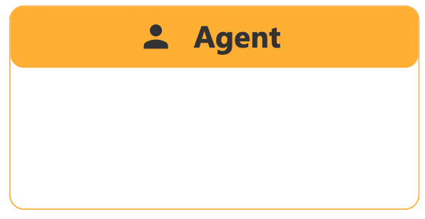

import Tabs from '@theme/Tabs';
import TabItem from '@theme/TabItem';

# Cheatsheet
<Tabs>
  <TabItem value="primitives" label="Primitives" default>

Hier findest du alle Funktionsbausteine auf einem Blick!

| Primitive     | Typ |    Bedeutung       | Beispiele |
| ----------- | ----------- |----------- | ----------- |
|   | SD     | 1.Akkumulierte Größen bzw. Werte, die sich im Laufe der Zeit ansammeln oder abbauen 2.Speichert aktuellen Wert zu unterschiedlichen Berechnungszeitschritten 3.Ändert sich durch Zuflüsse (Inflows) oder Abflüsse (Outflows)  | Bevölkerungszahl, Wasserstand, Energieinhalt | 
|   | SD     | 1.Beschreiben die Geschwindigkeit, mit der sich ein Bestand aufbaut oder abbaut 2.Verändern den Stock, aber speichern selbst keine Werte 3.Können von anderen Variablen abhängen | Geburtenrate, Wasserzufluss, Energieverbrauch | 
|   | Common     | 1.Moderner Standard des Open Geospatial Consortium (OGC) 2.Bereitstellung und Abfrage von Geodaten über Webschnittstellen 3.Datensätze aus Geoportal über das Masterportal Hamburg | Volkszählungen, Bezirksdaten, Infrastruktur | 
|   | Common     | 1.Größenveränderliche Einflussfaktoren 2.Keine Speicherfunktion der Werte  3.Beeinflussen andere Berechnungsgrößen |  | 
|   | Common     | 1.Führt eine Berechnung, Transformation oder Ableitung aus anderen Variablen oder Konstanten durch 2.Ähnlich wie Hilfsvariable und speichert keine Werte, sondern wird bei jeder Simulationszeit neu berechnet  3.Stellt grafisch Input-Output Relationen dar|  |
|   | common    | 1.Strukturgebendes Element, welches die Organisation eines Modells vereinfacht  2.Ausgewählte Modellteile können gesammelt, gruppiert und bewegt werden |  |
|   | ABM     | 1.Bezeichnet Zustand von aktueller Situation oder Konfiguration eines Agenten, die sein Verhalten beeinflusst 2.Wechseln von einem State in einen anderen, ausgelöst durch Regeln, Wahrscheinlichkeiten oder Umwelteinflüsse |  |
|   | ABM     | 1.Bezeichnen Übergänge zwischen den Zuständen eines Agenten 2.Wann und unter welchen Bedingungen soll Agent von einem Zustand in einen anderen wechseln? |  |
|   | ABM     | 1.Konkrete Handlungen, die ein Agent während eines Zustandes oder bei einem Zustandswechsels (Transitions) ausführt 2.Beschreiben operationale Verhaltensregeln, wie beispielsweise sich bewegen, mit anderen Agenten interagieren, Ressourcen verbrauchen etc. |  |
|   | ABM     | 1.Ist autonome Entität, die eigene Zustände, Eigenschaften und Verhaltensregeln besitzt  2.Kann mit ihrer Umwelt und anderen Agenten interagieren 3.Können eigenständige Entscheidungen treffen, zustandsabhängig handeln, sich verändern und lokal interagieren |  |
|   | ABM     | 1.Gesamtheit aller Agenten eines bestimmten Typs innerhalb eines Modell  2.Kollektive Menge an Agenten haben gemeinsame Eigenschaften oder Verhaltenstypen |  |

  </TabItem>
  <TabItem value="interface" label="Interface">
    Hier findest du alle wichtigen Komponenten der Benutzeroberfläche auf einem Blick!
  </TabItem>
  <TabItem value="funktionen" label="Funktionen">
    Hier findest du die grundlegensten Funktionen auf einem Blick!
  </TabItem>
  <TabItem value="fragenkatalog" label="Fragenkatalog">
    Hier findest du eine Liste an Denkanstößen zum Thema Modellieren auf einem Blick!
  </TabItem>
   <TabItem value="glossar" label="Glossar">
    Hier findest du einige wichtige Begriffsdefinitionen auf einem Blick!
  </TabItem>
</Tabs>

