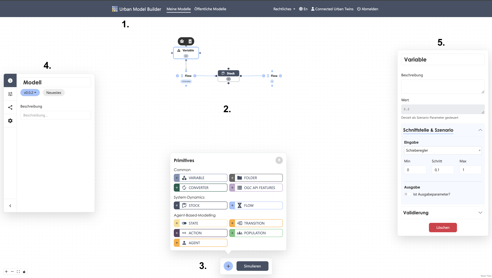

# Interface
## Strukturelemente 

### 1. NaviBar
Neben dem Urban Model Builder - Menüpunkt, über den die Startseite aufgerufen wird, enthält die obere Menüleiste zwei Übersichtslisten sowohl zu deinen privaten Modellen als auch zu allen veröffentlichten Modellen. Veröffentlichst du deine Modelle werden sie dir in beiden Listen angezeigt. Die Auflistung enthält die wichtigsten Tags und Informationen über die Modelle, wie die Anzahl der Modellversionen und deren Status, deine Rolle, das Erstellungsdatum und die letzte Änderung. Mithilfe der nebenstehenden Icons kannst du das jeweilige Modell öffnen, dessen Namen und Beschreibung bearbeiten oder das Modell löschen.  

:::warning

Das Löschen von Modelldaten ist unwiderruflich.

:::

Über das Drop-Down-Menü "Rechtliches" stehen dir alle wichtigen Informationen bezüglich des Datenschutzes, der Nutzungsbedingungen und weitere Kontaktdaten im Impressum jeder Zeit zur Verfügung. 
Der Urban Model Builder ist zudem auf Deutsch und Englisch verfügbar.
Über den Log-Out Menüpunkt kannst du dich manuell abmelden. Erfolgt nach geraumer Zeit keine Anfrage mehr an den Server, wird dein Benutzerkonto automatisch abgemeldet. 

### 2. Canvas
Die Arbeitsoberfläche des Urban Model Builders ist ein zweidimensionaler unbegrenzter Canvas, auf dem sich der Nutzer frei bewegen kann. Dies bildet den zentralen Modellierungsbereich, in dem die Systemstruktur visuell aufgebaut wird. Hier erfolgt die Platzierung und Verbindung von Elementen.
Die Oberfläche gliedert sich in folgende Bereiche:

### 3. ActiveBar
Auf der Arbeitsoberfläche befindet sich zentral im unteren Bereich die ActiveBar mit zwei der wichtigsten Hauptfunktionen des Tools. Zum einen enthält sie die elf Primitives, die du mittels des Plus- Buttons aufrufen kannst und zum anderen den Simulations- Button, mittels den du deine Berechnungen starten kannst. Das Fenster, das die Primitves enthält, kannst du zwecks optimierten Workflows anpinnen. wenn du auf das gewünschte Primitive klickst, erscheint es in der Mitte der Arbeitsoberfläche.

### 4. SideBar
Auf der linken Seite der Arbeitsoberfläche befindet sich eine einklappbare SideBar, in der sich übergeordnete Einstellungen finden lassen. Dazu zählen die allgemeinen Modellinformationen (Modellname, Versionsnummer und Beschreibung), die Szenario- Einstellungen, die Versionseinstellungen und die globalen Modelleinstellungen. 

### 5. Primitive- Einstellungsfenster
Mit einem Klick auf das jeweilige Primitve öffnet sich auf der rechten Seite der Arbeitsoberfläche das Einstellungsfenster für die entsprechenden Parameter. Unter [Primitives](Primitives.md) findest du eine detaillierte Beschreibung zu der Art der Eingaben und die Bedeutung der Parametersetzung.

Die Arbeitsoberfläche des Urban Model Builders ist ein zweidimensionaler Canvas, auf dem sich der Nutzer durch ziehen und zoomen des Mauszeigers frei bewegen kann. 
Die untere Bar beinhaltet sowohl die Übersicht der Primitive, welche durch das Plus-Icon sichtbar werden. Zwecks optimierten Workflows kann das Fenster mit dem Icon oben rechts angepinnt werden. Außerdem befindet sich in der Bar der Startbutton zur Berechnung der Simulation. 
Auf der linken Seite ist eine einklappbare Sidebar, wo sich die Modellinformationen (Modellname, Versionsnummer und Beschreibung), die Szenario-Einstellungen, die Versionseinstellungen und die globalen Modelleinstellungen befinden. 
Mit einem Klick auf das jeweilige Primitive öffnet sich auf der rechten Seite der Arbeitsfläche das Einstellungsfenster für die entsprechenden Parameter.

## Handhabung 

### 1. Elemente platzieren 
Wähle in der unteren ActiveBar ein Modellierungselement aus. Es wird automatisch auf der Arbeitsoberfläche platziert.
:::tip Hinweis
Erstelle eine Geistervariable eines Primitives, indem du es auswählst und auf das Geist- Icon klickst. Dadurch kannst du dein Modell übersichtlicher strukturieren und Primitves an einer anderen Stelle im Modell platzieren, ohne ein Gewirr von langen Verbindungen! 
:::
### 2. Elemente verbinden
Um die Modellierungselemente in Abhängigkeit zu setzen, verbinde sie grafisch miteinander. Indem du den Mauszeiger über einen der Knotenpunkte des Ausgangs-Primitives bewegst, wird dieser zum Fadenkreuz. Halte die linke Maustaste gedrückt und ziehe das Fadenkreuz zu dem Knotenpunkt des Primitives, welches du mit dem anderen in Relation bringen möchtest. Die erstellte Verbindung wird dir in Form eines Pfeils dargestellt, der dir gleichzeitig die Richtung der Abhängigkeit anzeigt. Das Primitive, auf das die Pfeilspitze zeigt, verwendet den Wert des anderen Primitves als Input.  
:::tip Hinweis
Bei den Primitves *Flow* und *Transition* sind die Knotenpunkte in ihrer Funktionsweise definiert. Die Richtung wird durch gekennzeichnete In- und Outputpfeile vorgeschrieben. Du kannst die Ausrichtung dieser festgelegten Richtung ändern, indem du das Primitve auswählst und auf das Rotation- Icon klickst.
:::

### 3. Parameter setzen 
Nach Auswahl eines Elements kannst du im Eigenschaftenfenster die gewünschten Parameter setzen. Füge individuelle Gleichungen ein oder nutze die bereits integrierten Funktionen. Den Wert des verbunden Primitves kannst du als einen Inputwert nehmen, indem du (nach dem grafischen Verbinden) auf den Button unter dem Werteingabe-Feld klickst.
:::tip Hinweis
Achte darauf, dass der Name des Primitves und die Bezeichnung in den eckigen Klammern im Werteingabe-Feld des verbundenen Primitves übereinstimmen (Leerzeichen beachten). Benennst du im Laufe des Modellierungsprozesses Primitives um, musst du diese in den Wertefeldern anpassen, sonst kann das Modell nicht berechnet werden. 
:::
:::warning

Mit dem Klick auf den Löschen- Button im Eigenschaftenfenster, entfernst du **nicht** den eingegeben Inhalt der Eingabefelder, sondern das gesamte Primitive. Das Löschen von Primitives ist unwiderruflich.

:::

### 4. Simulation starten 
Über die Schaltfläche "Simulieren" wird das Modell mit den gesetzten Parametern berechnet. Dabei öffnet sich in der Mitte der Arbeitsoberfläche ein neues Fenster, in dem die Simulationsergebnisse in Form einen Liniendiagramms oder eines Streuungsdiagramms angezeigt werden. Die Geschwindigkeit des Aufbaus der Anzeige kannst reguliert werden.
