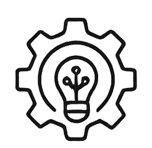
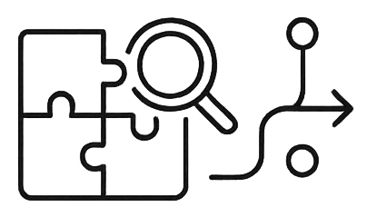
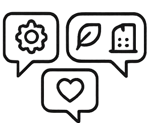
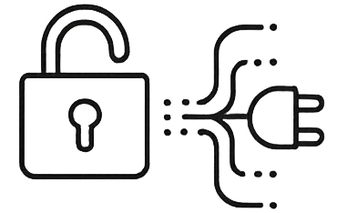
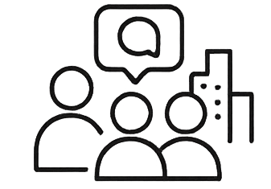
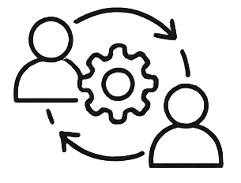

## Ausblick
Mit einem Blick in die Zukunft gerichtet, hoffen wir, dass ...

... der Urban Model Builder eine anregende und inspirierende Plattform bietet, um den Ansatz der Co- und 
    Multimodellierung voranzutreiben 

... durch die vielseitige Einsetzbarkeit des Tools eine breit gefächerte Modelllandschaft zur Exploration von "Was-wäre-wenn..."-Szenarien entsteht 

... der Datenaustausch und die Kommunikation zwischen interdisziplinären Abteilungen und Fachdisziplinen gefördert werden kann

... durch Ergänzungen weiterer API Schnittstellen vermehrt verschlossene Datensilos aufgebrochen werden können und die Zahl von interoperablen Anwendundungsfällen steigt

... öffentliches Interesse an der Partizipation von Stadtentwicklungsprozessen gefördert wird 

... durch das kollaborative Arbeiten bestehende Prozesse reflektiert, hinterfragt und optimiert werden können

