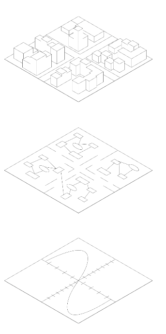

# System Dynamics & Agentenbasierte Modelle

## Stadtebene

Die Stadt lässt sich als ein komplexes System verstehen, welches von oben betrachtet - im Sinne eines Top-Down Ansatzes - große Dynamiken mit zahlreichen kausalen Abhängigkeiten beinhaltet. 
Um dieses System oder vielmehr dessen Subsysteme annähernd abbilden zu können, werden **System Dynamics** Modelle verwendet. System Dynamics ist eine modellbasierte Simulationsmethode basierend auf der allgemeinen Systemtheorie bzw. Kybernetik. Hierbei geht es um die Wirksamkeit und das Verhalten von komplexen Systemen, die sich besonders durch verzögerte Ursache-Wirkungs-Beziehungen als auch durch Rückkopplungsrelationen zwischen einzelnen Variablen auszeichnen. Anstelle einer ausschließlichen Betrachtung von linearen Ursache-Wirkungsketten werden bei dem System Dynamics Ansatz Kausalitäten eines Systems und ihr Verhalten sowohl ganzheitlich als auch über die Zeit betrachtet. Als zentrale Elemente gelten dabei Feedback-Schleifen, Bestandsgrößen (Stocks) und Flussgrößen (flows). Diese Methode wurde in den 1950er Jahren von Jay W. Forrester entwickelt. Weitere Hintergründe zu System Dynamics finden Sie hier (Link: Handbook of SDM)

Eine andere Simulationsmethode bilden **agentenbasierte Modelle**. Hierbei wird sich dem komplexen Verhalten von Lebewesen modellhaft angenähert. Auf der im Sinne eines Bottom-Up Ansatzes betrachteten Stadtebene können somit auch Ströme durch einzelne Entitäten modelliert werden, dessen Interaktionen sich gegenseitig bedingen und die nach Zweck und Aufbau des Modells Aufschluss über die georeferenzierten Daten liefern. Weitere Hintergründe zu agentbased Modeling finden Sie hier (Link: )

## Prozessebene 

Blickt man hinter die Fassade der Stadtebene entdeckt man eine Vielzahl an miteinander vernetzten Prozessen. Für bestimmte Fragestellungen und Problem-Modellierungen ist es notwendig sich solche Netzwerke aufzubauen, um die Logik von Abläufen zu erkennen, zu verstehen und annähernd abbilden zu können und darauf basierend Lösungen zu finden. Wie in der Logik von Prozessdiagrammen setzen sich diese Modelle aus einzelnen Funktionsbausteinen zusammen, dessen Einheit simuliert bzw. mathematisch berechnet werden kann. Innerhalb eines Modells können diese Simulationen als kleinste Einheit im Metasystem der Stadtentwicklung betrachtet werden. Sie simulieren unterschiedliche Zukünfte, also „Was-wäre-wenn…“-Szenarien, die in der Stadtentwicklung zu einer robusteren Grundlage für Entscheidungsfindungen führen können. 

Bei **System Dynamics** sind typischerweise Bestände und Flüsse, ergänzt durch Feedbackschleifen und Zeitverzögerungen, die kleinsten Modellierungselemente. Diese Elemente beschreiben kontinuierlich, aggregierte Veränderungen in einem System- z.B. den Anstieg einer Bevölkerung - auf mikroskopischer Ebene. Die kleinste Einheit ist also keine einzelne Entität, sondern ein abstrakter, kumulativer Zustand.

Im Gegensatz dazu bestehen **agentenbasierte Modelle** aus einer Vielzahl individueller, oft heterogener Agenten als kleinste Einheiten. Die Agenten verfügen über eigene Regeln, Entscheidungslogiken und Verhaltensweisen und interagieren mit ihrer Umwelt sowie miteinander. Das Modellverhalten entsteht hier emergent aus der Mikroebene der Agentenaktionen - also aus dem Zusammenspiel vieler kleiner Einheiten.

## Berechnungsebene

Differenzialgleichungssysteme sind die Berechnungsgrundlage von **System Dynamics**, weil sie zeitabhängige Veränderungen von Zuständen in einem dynamischen System modellieren. Ein Differenzialgleichungssystem besteht aus mehreren gekoppelten Gleichungen, die beschreiben, wie sich Zustandsgrößen über die Zeit verändern.

dxn/dt= fn(x1,x2….xn,t)

Jede Gleichung beschreibt die Änderungsrate einer Zustandsgröße xi , wie sie sich pro Zeiteinheit verändert in Abhängigkeit von anderen Größen.
Stocks - Zustandsgrößen xi(t)
Flows - Änderungsraten dxi/dt
Feedback loops - Kopplung zwischen Gleichungen (zB fi hängt von xk ab)
Simulation - Numerische Lösung dieser Gleichungen über die Zeit 

In **agentbasierten Modellen** wird, statt globalen Gleichungen für das gesamte System wie bei SD, das Verhalten einzelner, autonomer Agenten beschrieben, die einfachen Regeln folgen, mit ihrer Umwelt interagieren und sich gegenseitig beeinflussen. Das globale Systemverhalten emeritiert aus dem Zusammenspiel vieler individueller Agenten.
Agentenbasierte Modelle basieren typischerweise nicht auf Differentialgleichungssystemen, sondern auf regelbasierten Systemen, wie logischen Entscheidungsregeln oder zeitdiskreten Simulationen in Schritten,stochastischen Prozessen wie Übergangswahrscheinlichkeiten zwischen Zuständen, oder Event-basierten Modellierung wie Ereignisse den Zustand einzelner Agenten ändern zu bestimmten Zeitpunkten (z.B. Agent stirbt bei Kontakt mit Virus)

