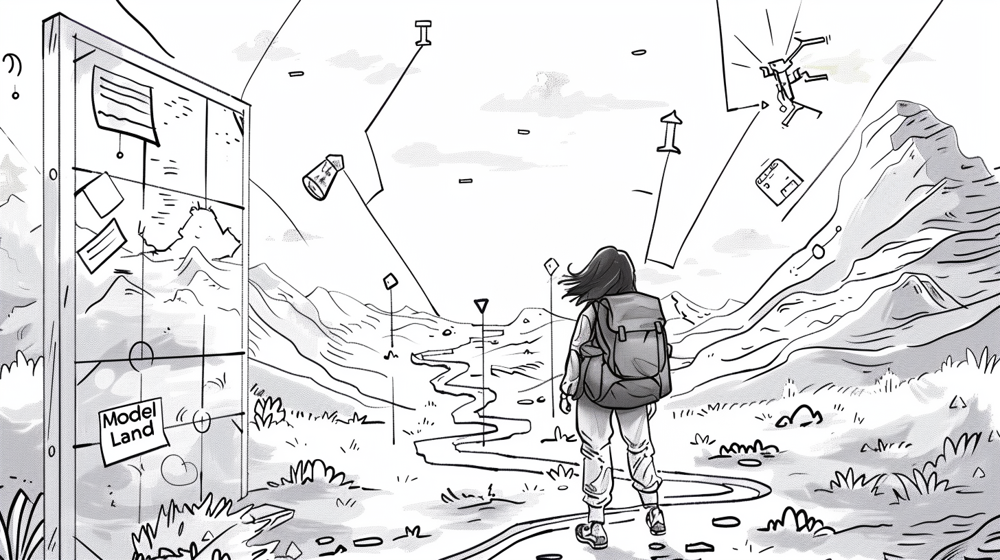

# Model Land navigieren

## Modell simulieren

Du befindest dich mitten im Model Land und stehst vor einer Vielzahl an Optionen, Weggabelungen, Kreuzungen, ja vielleicht sogar Sackgassen und Baustellen. Du hast einen Teil der realen Welt codiert und daraus dein Modell aufgebaut. Im Model Land existiert nun eine ganz eigene Logik, die du alleine oder zusammen mit einem Team konzipiert hast. Exploriere die Vielzahl an Möglichkeiten, die Wege, die Aktivitäten, die Umgebung. Die Welt ist aufregend und du kannst sie während deiner Reise aktiv verändern, optimieren und lenken. Du fragst dich vielleicht oft "Was-wäre-wenn...?". Hier ist ein Ort, um genau diesen Fragen auf den Grund zu gehen! 

Du schaust auf deine mitgebrachte Landkarte. Leere Bereiche markieren die unentdeckten Gebiete deines Modells. Manche von ihnen kannst du leichter erreichen, manche unwahrscheinlicher. Manche Pfade sind geprägt von tiefen Unsicherheiten, wodurch das Ankunftsziel nicht gerade robust erscheint.  

Um dir eine möglichst resiliente und standhafte Meinung zu bilden, bist du davon überzeugt: Je mehr Wege du entlang gehst, desto sicherer kannst du behaupten, welcher dieser Wege, der schönste, der bequemste, der längste, aber mit der besten Aussicht, der anstrengenste, aber der schnellste, oder der unsicherste ist. Teste eine Vielzahl an Szenarien! Wie?

Die herrschenden Umstände, Bedingungen und Abhängigkeiten kannst du auf globaler und lokaler Ebene konfigurieren - ganz so als würdest du die Klimazone für das Modell auf globaler Ebene und das Wetter auf lokaler Ebene einrichten.

- Unter den [Modell-Einstellungen](../Einstellungen/Modell-%20Einstellungen) setzt du die globalen Parameter.

- Die [Szenario-Einstellungen](../Einstellungen/Szenario-%20Einstellungen) ermöglichen es dir unterschiedliche Konfigurationen auszuprobieren.

Du gehst einen Weg entlang, für den du dich entschieden hast. Auf der Karte siehst du langsam, wie sich der Weg nach und nach schrittweise aufbaut. Die [Simulation](../Simulation%20durchführen) wird durchgeführt und zeigt dir letztendlich dein Ankunftsziel an. Ob es das Ziel ist, was du erwartet hast, wo du hin wolltest, ob es dein Endziel oder nur ein Zwischenstopp ist, entscheidest du. Natürlich kannst du deine Mitreisenden nach ihrer Sichtweise fragen! - Mache die Ergebnisse transparent,  [veröffentliche das Modell](../Publizieren/Modell%20veröffentlichen) für die ganze Community oder [teile das Modell](../Publizieren/Modell%20teilen) mit ausgewählten Nutzer:innen.

Du möchtest dir einen Weg merken, aber einen anderen noch ausprobieren? Erstelle unterschiedliche [Modellversionen](../Einstellungen/Versions-Einstellungen) und halte deine Reise fest.

Zukunft ist nicht vorhersagen, sondern entdecken. 

