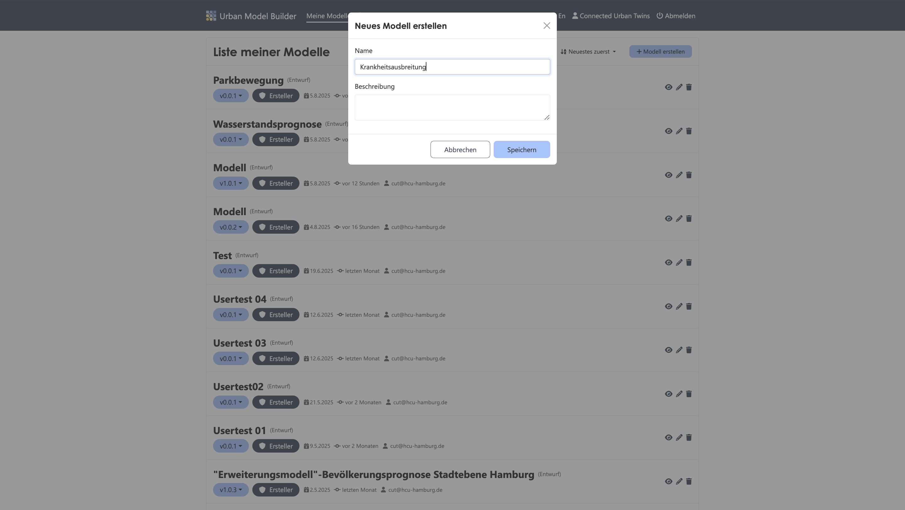

# Agent-Based Model

# Krankheitsausbreitung
Stell dir vor, du möchtest simulieren, wie sich ein Krankheitserreger innerhalb einer Bevölkerungsgruppe über einen bestimmten Zeitraum ausbreitet. Dabei beeinflussen sich die Agenten gegenseitig - sie stecken sich gegenseitig an, wenn sie zufällig aufeinander treffen. Zustände ändern sich somit ständig von "anfällig" über "infiziert" bishin zu "genesen". Die folgende Schritt-für-Schritt-Anleitung zeigt dir, wie du in nur wenigen Schritten dein erstes agentenbasiertes Modell aufbaust!

---
# 1. Neues Modell
✔︎ Erstelle ein neues Modell und nenne es "Krankheitsausbreitung"



---
# 2. Agent-Typ "Person" erstellen
✔︎ Füge einen Agenten hinzu und nenne ihn "Person"

✔︎ Ziehe das Fenster des Primitives auf dem Canvas größer, um die nächsten Primitives hinein zu platzieren


---
# 3. State "anfällig" erstellen
✔︎ Füge ein State im Agenten "Person" hinzu und nenne ihn "anfällig"

✔︎ Zum Startzeitpunkt ist dieser Zustand korrekt, somit setze den Parameter auf ```true```

✔︎ Die Vorhaltezeit beträgt ```0```


---
# 4. State "infiziert" erstellen

✔︎ Füge ein State im Agenten "Person" hinzu und nenne ihn "infiziert"

✔︎ Verbinde den State "anfällig" mit dem State "infizieren"

✔︎ Zum Startzeitpunkt ist dieser Zustand ```not [anfällig]```. Hierzu kannst du den Wert des verbundenen Primitives "anfällig" übernehmen

✔︎ Die Vorhaltezeit beträgt ```0```


---
# 5. State "genesen" erstellen

✔︎ Füge ein State im Agenten "Person" hinzu und nenne ihn "genesen"

✔︎ Zum Startzeitpunkt ist dieser Zustand nicht korrekt, somit setze den Parameter auf```false```

✔︎ Die Vorhaltezeit beträgt ```0```


---
# 6. Transition "Krankheitserreger" erstellen

✔︎ Füge eine Transition im Agenten "Person" hinzu und nenne ihn "Krankheitserreger"

✔︎ Verbinde den State "anfällig" mit dem State "infiziert" über diese Transition

✔︎ Der Auslöser ist eine "Condition" und bedingt sich durch Kontakt zu anderen Agenten nach 5 Jahren

✔︎ Setze den Wert auf```Self.Index()=1 and Years=5```

✔︎ Lasse den Wert bei jedem Zeitschritt "neuberechnen"


---
# 7. Transition "Erholung" erstellen

✔︎ Füge eine Transition im Agenten "Person" hinzu und nenne ihn "Erholung"

✔︎ Verbinde den State "infiziert" mit dem State "genesen" über diese Transition

✔︎ Der Auslöser ist eine "Probability". Die Annahme ist, dass pro Zeitschritt 9% der infizierten Personen sich erholen.

✔︎ Setze den Wert auf ```0.09```

✔︎ Lasse den Wert bei jedem Zeitschritt "Neuberechnen"


---
# 8. Transition "Übertragung" erstellen

✔︎ Füge eine Transition im Agenten "Person" hinzu und nenne ihn "Übertragung"

✔︎ Verbinde den State "anfällig" mit dem State "infiziert" über diese Transition

✔︎ Der Auslöser ist eine "Probability". Die Wahrscheinlichkeit infiziert zu werden, hängt von der Population ab, die wir im späteren Verlauf modellieren.


---
# 9. Action "Erreger einfangen" erstellen

✔︎ Füge eine Action im Agenten "Person" hinzu und nenne ihn "Erreger einfangen"

✔︎ Verbinde den State "anfällig" mit dieser Action 

✔︎ Der Auslöser ist eine "Condition" und bedingt sich ebenfalls durch die Population, die wir im nächsten Schritt modellieren.


---
# 10. Population erstellen

✔︎ Füge eine Population hinzu, die durch die Verbindung zum Agenten "Person" das Verhalten auf eine ganze Population anwendet

✔︎ Setze die Werte wie folgt:

Größe der Bevölkerung: ```100```

Geo Breite: ```200```

Geo Höhe: ```200```

Geo Platzierung: "Random"

Netzwerktyp: "keine"

✔︎ Stelle die Population als Output-Parameter ein


---
# 11. Gleichungen für Action "Erreger einfangen" setzen

✔︎ Verbinde die Population mit der Action "Erreger einfangen" im Agenten "Person"

✔︎ Setze die Aktionsfunktion auf ```Self.moveTowards([Population].FindState([infiziert]).FindNearest(Self), -0.5)```

✔︎ Setze den Wert auf ```[anfällig] and [Population].FindState([infiziert]).count()> 0```


---
# 12. Gleichungen für Transition "Übertragung" setzen

✔︎ Verbinde die Population mit der Transition "Übertragung" im Agenten "Person"

✔︎ Setze den Wert auf: 
```
infectors <- [Population].FindState([infiziert]).FindNearby(Self, 25)

probInfect <- min(1, infectors.Map(1/(distance(x, Self))^.75))

1 - Product(Join(1, 1 - probInfect))
```
✔︎ Lasse den Wert bei jedem Zeitschritt "Neuberechnen"


---
# 13. Variable "Prozentsatz Infizierte" erstellen

✔︎ Füge eine Variable hinzu und nenne sie "Prozentsatz Infizierte"

✔︎ Verbinde die Population mit dieser Variablen

✔︎ Setze den Wert auf ```[Population].FindState([infiziert]).Count()/[Population].FindAll().Count()*100```

✔︎ Stelle die Variable ebenfalls als Output-Parameter ein


---
# 14. Simulationseinstellungen

✔︎ Öffne die Modell Einstellung in der Sidebar 

✔︎ Setze die Werte wie folgt:

Start: 0
Länge: 20 
Intervall: 1 
Einheit: Jahre


---
# 15. Simulation starten 
✔︎ Starte die Berechnung der Simulation, indem du auf den "Simulieren"-Button in der Activebar klickst

✔︎ Schaue dir das Streudiagramm an, indem du auf den "Scatter-Plot" Reiter klickst 


Fertig ist dein erstes agentenbasiertes Modell!