# OGC API Feature

# Bevölkerungsprognose Hamburg
Stell dir vor, du möchtest wissen, wie sich die Bevölkerungszahl in Hamburg in den nächsten Jahren verändern könnte. Als Initialwert nimmst du den realen Datensatz der aktuellesten Volkszählung von 2023. Durch Wachstum anhand von Geburten und Abnahmen durch Sterbefälle verändert sich das System dynamisch über die Zeit. Die folgende Schritt-für-Schritt- Anleitung zeigt dir, wie du in nur wenigen Schritten dein erstes System Dynamics Modell mit realem Datensatz-Feature aufbaust!

---
# 1. Neues Modell
✔︎ Erstelle ein neues Modell und nenne es "Bevölkerungsprognose Hamburg"

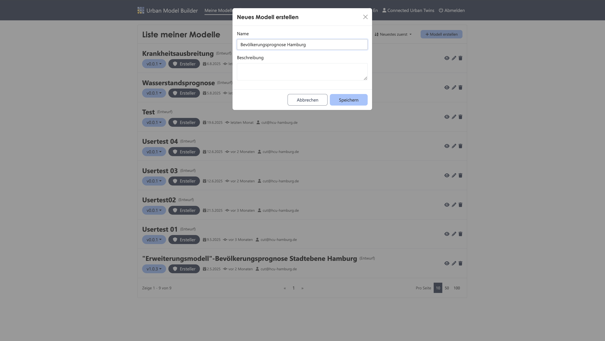

---
# 2. Stock "Aktuelle Bevölkerung" erstellen
✔︎ Füge einen Stock hinzu, welchen du über das Plus-Icon in der Activebar findest

✔︎ Öffne die Parameter Einstellung des platzierten Stocks, indem du darauf klickst und nenne ihn "Aktuelle Bevölkerung"

✔︎ Stelle den Stock als Output-Parameter ein

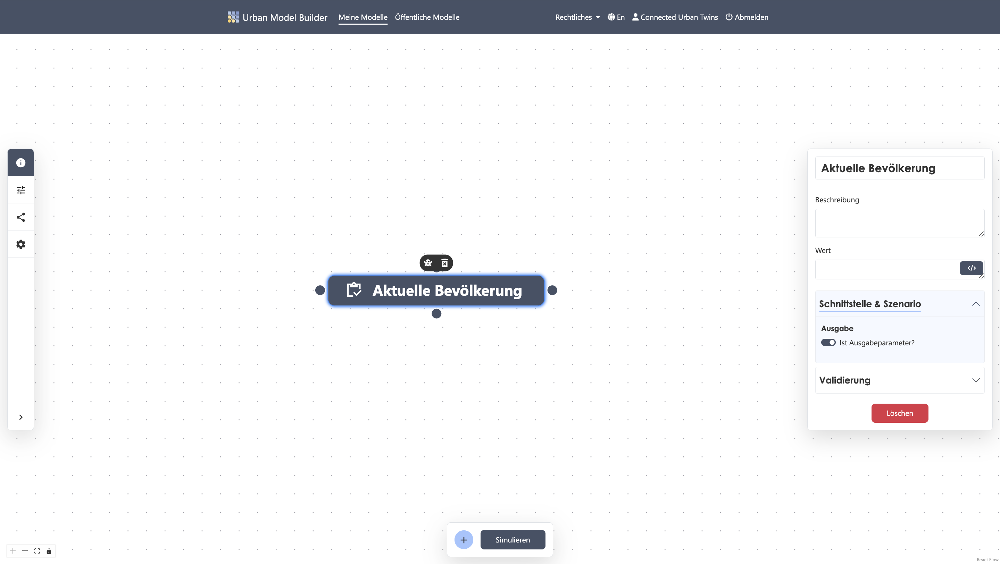

---
# 3. OGC API Feature "Bevölkerungsdatensatz 2023" erstellen
✔︎ Füge ein OGC API Feature hinzu und nenne es "Bevölkerungsdatensatz 2023"

✔︎ Wähle unter APIs "Regionalstatistische Daten der Bezirke Hamburgs und Hamburg insgesamt" aus

✔︎ Wähle unter Sammlung "Regionalstatistische Daten Hamburg insgesamt" aus

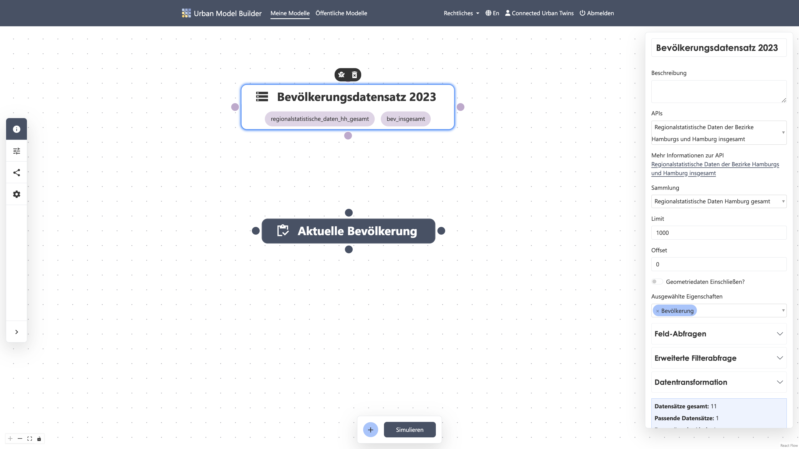

✔︎ Setze unter **Feld-Abfrage** folgende Werte: 

Abfragefeld:```Jahr```
Operator:```=```
Abfragewert:```2023```

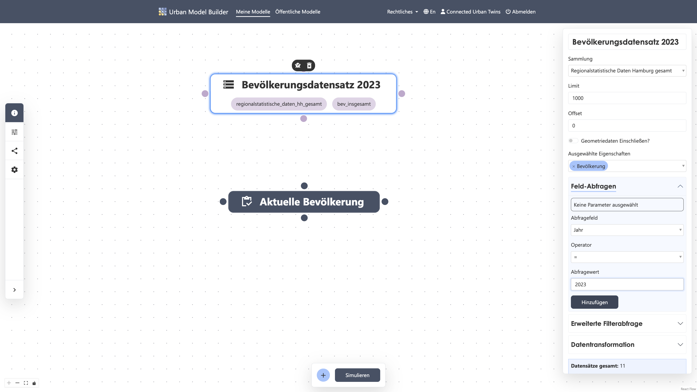

✔︎ Setze unter **Datentransformation** folgende Werte:

Schlüsselfeld:```Bevölkerung```
Wertfeld:```Bevölkerung```

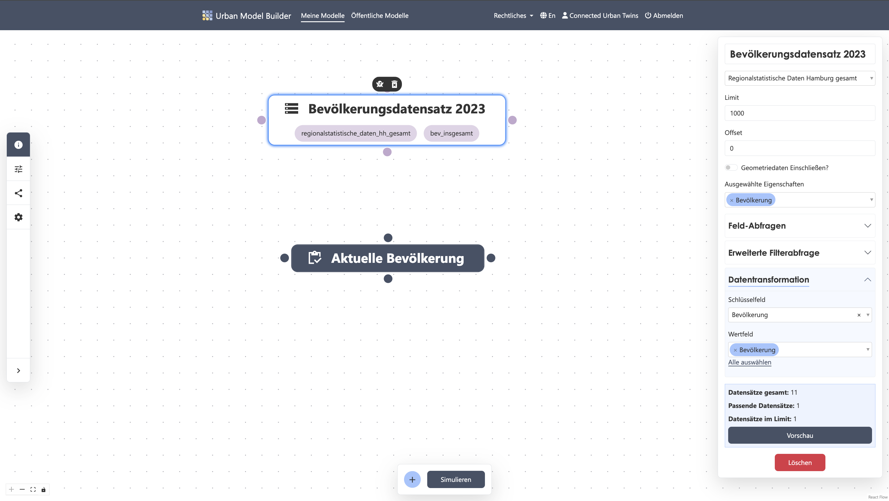
---
# 4. Verbindung zum Stock "Aktuelle Bevölkerung" erstellen
✔︎ Verbinde nun den Ausgangs-Knotenpunkt des API Features "Bevölkerungsdatensatz 2023" mit einem Knotenpunkt des Stocks "Aktuelle Bevölkerung"

✔︎ Öffne die Parameter Einstellung des Stocks "Aktuelle Bevölkerung", indem du darauf klickst

✔︎ Füge den Wert ```[Bevölkerungsdatensatz 2023]``` hinzu, indem du auf den Button unter dem Wertfeld klickst
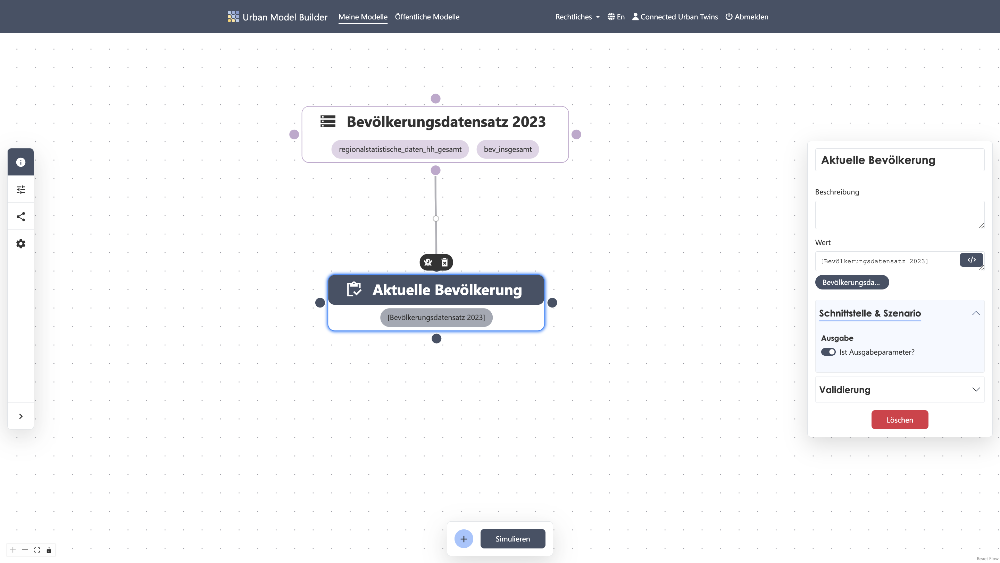

---
# 5. Inflow "Wachstum" erstellen
✔︎ Füge einen Flow hinzu und nenne ihn "Wachstum"

✔︎ Verbinde nun den Ausgangs-Knotenpunkt des Flows mit einem Knotenpunkt des Stocks

✔︎ Achte darauf, dass der Verbindungspfeil zum Stock zeigt 
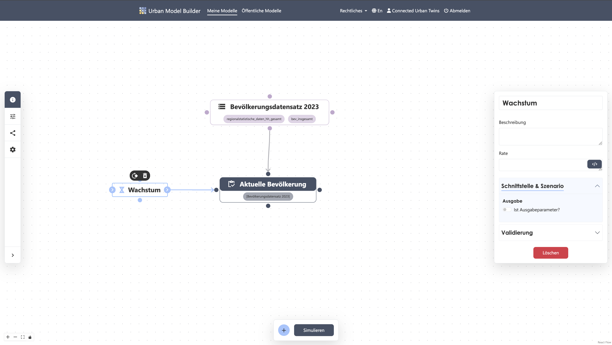

---
# 6. Variable "Geburtenrate" erstellen
✔︎ Füge eine Variable hinzu und nenne sie "Geburtenrate"

✔︎ Setze den Wert auf ```0.0096```

✔︎ Verbinde die Variable mit dem oberen oder unteren Knotenpunkt des Flows
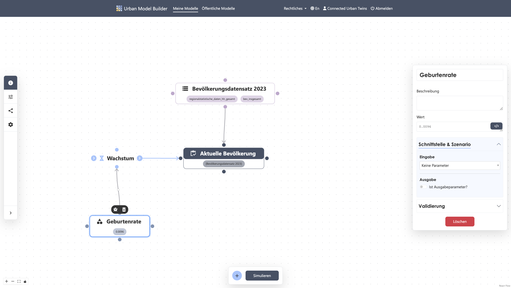

---
# 7. Gleichung im Inflow "Wachstum" anlegen
✔︎ Verbinde den Stock "Aktuelle Bevölkerung" mit dem oberen oder unteren Knotenpunkt der Variablen "Geburtenrate"

✔︎ Multipliziere die Werte der ```[Geburtenrate]```und der ```[Aktuellen Bevölkerung]```miteinander, indem du auf die Buttons unter dem Wertfeld klickst, um sie einzufügen
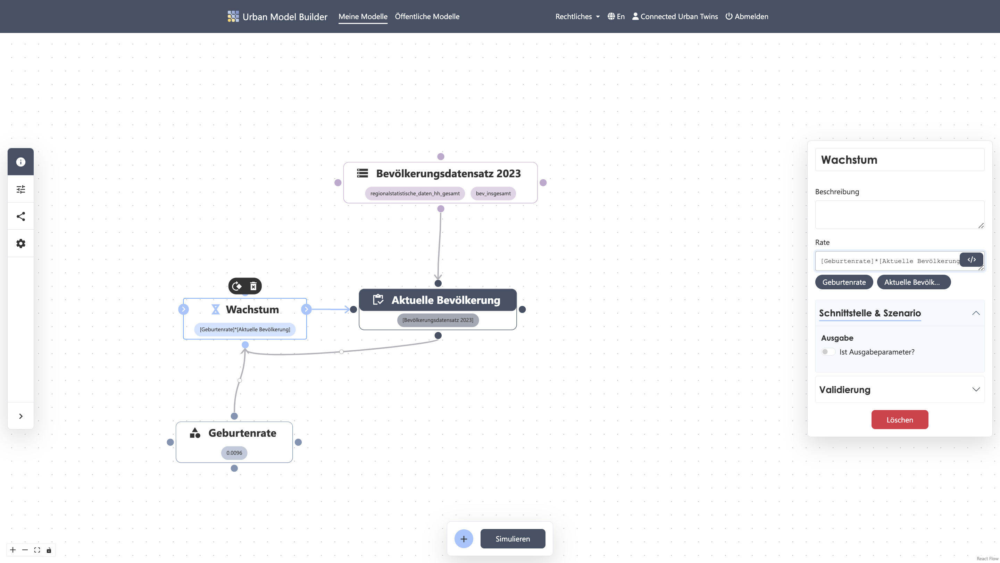

---
# 8. Outflow "Abnahme" erstellen
✔︎ Füge einen Flow hinzu und nenne ihn "Abnahme"

✔︎ Verbinde nun einen Knotenpunkt des Stocks "Aktuelle Bevölkerung" mit dem Eingangs-Knotenpunkt des Flows "Abnahme"
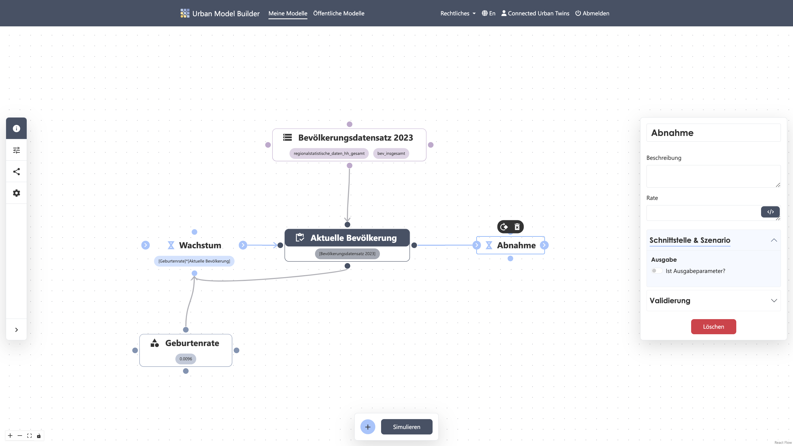

---
# 9. Variable "Sterberate" erstellen
✔︎ Füge eine Variable hinzu und nenne sie "Sterberate"

✔︎ Setze den Wert auf ```0.01```

✔︎ Verbinde die Variable "Sterberate" mit dem oberen oder unteren Knotenpunkt des Flows "Abnahme"
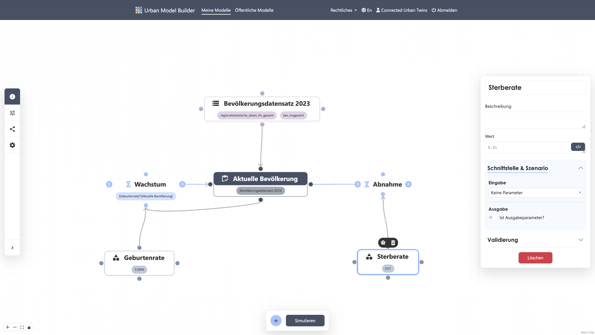

---
# 10. Gleichung im Outflow "Abnahme" anlegen
✔︎ Multipliziere die Werte der ```[Sterberate]```und der ```[Aktuellen Bevölkerung]```miteinander, indem du auf die Buttons unter dem Wertfeld klickst, um sie einzufügen
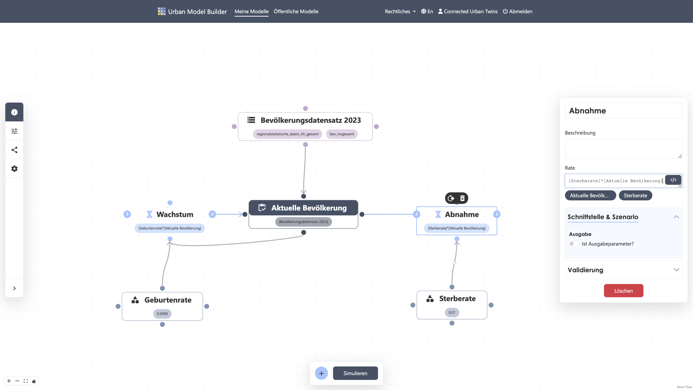

---
# 11. Simulationseinstellungen
✔︎ Öffne die Modell Einstellung in der Sidebar 

✔︎ Setze die Werte wie folgt:

Start: 0
Länge: 50 
Intervall: 5 
Einheit: Jahre
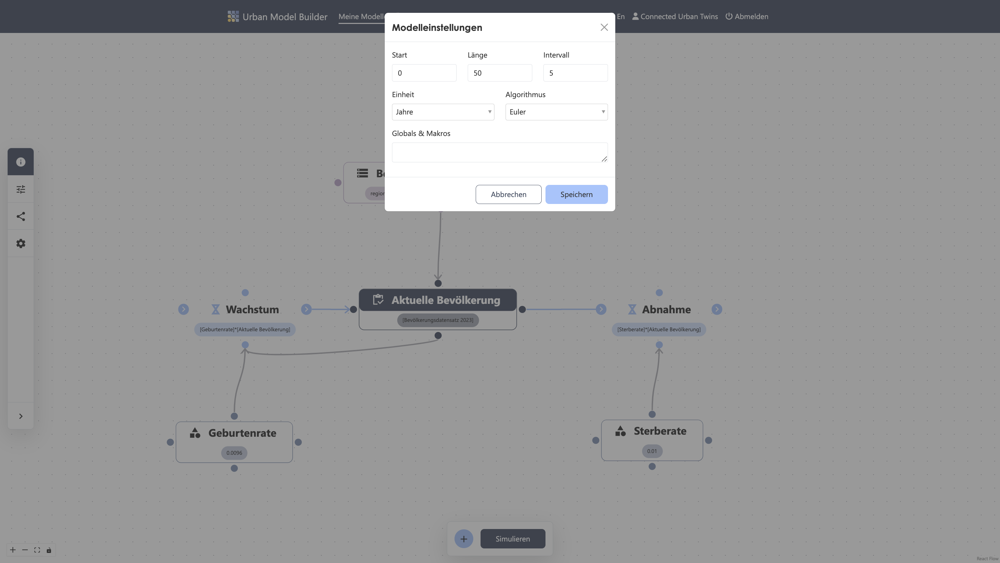

---
# 12. Simulation starten
✔︎ Starte die Berechnung der Simulation, indem du auf den "Simulieren"-Button in der Activebar klickst
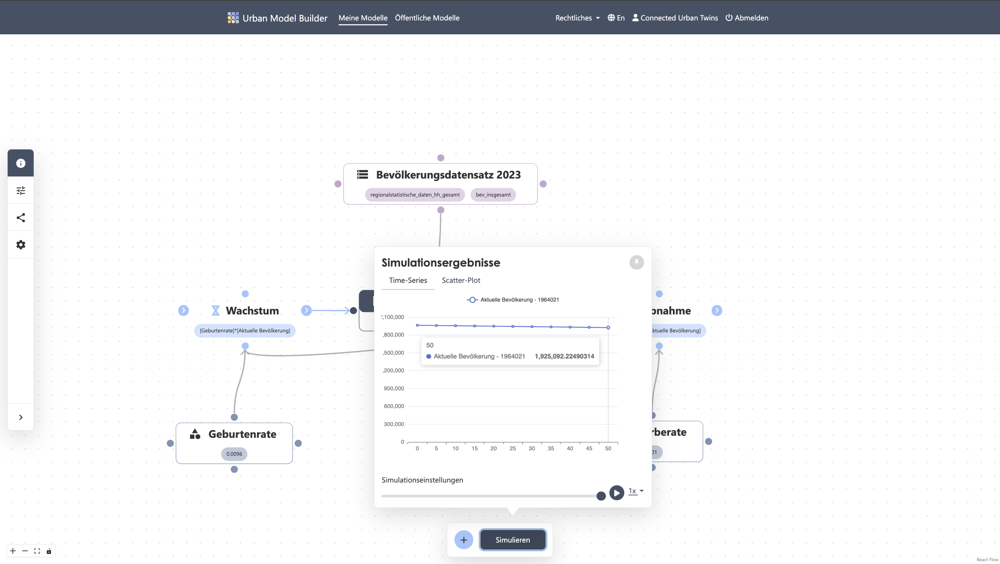

---
# 13. Szenario testen
✔︎ Variiere den Wert der Variablen "Geburtenrate", indem du die Parameter Einstellungen dieser Variablen öffnest, indem du darauf klickst

✔︎ Stelle unter Schnittstelle und Szenario einen Schieberegler ein und setze folgende Werte:
Min:```0,0096```
Schritt:```0,001```
Max:```0,02```

✔︎ Unter den Szenario-Einstellungen in der Sidebar findest du nun einen Schieberegler, mit dem du die Inputwerte der Variablen "Geburtenrate" flexibel einstellen und speichern kannst
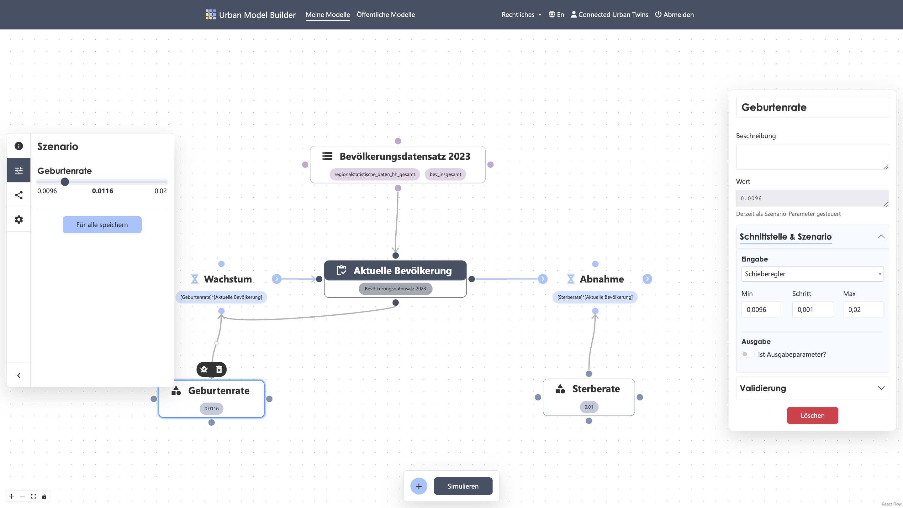

---
# 14. Simulation erneut starten
✔︎ Schau nach, welche Auswirkung deine Variation der Variablen "Geburtenrate" auf die "Aktuelle Bevölkerung" hat und starte die Simulation erneut

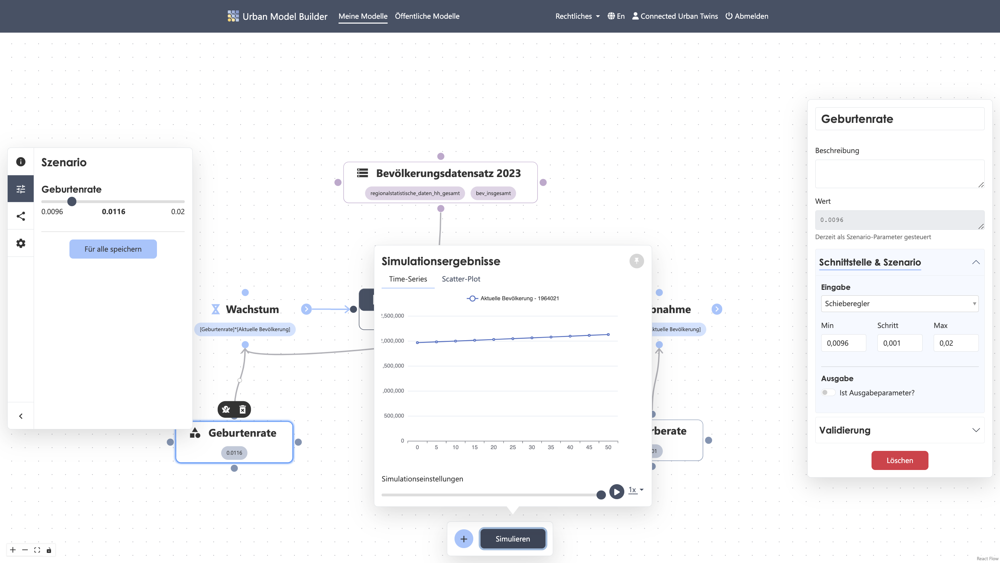

---
Fertig ist dein erstes System Dynamics Modell mit API Feature!


