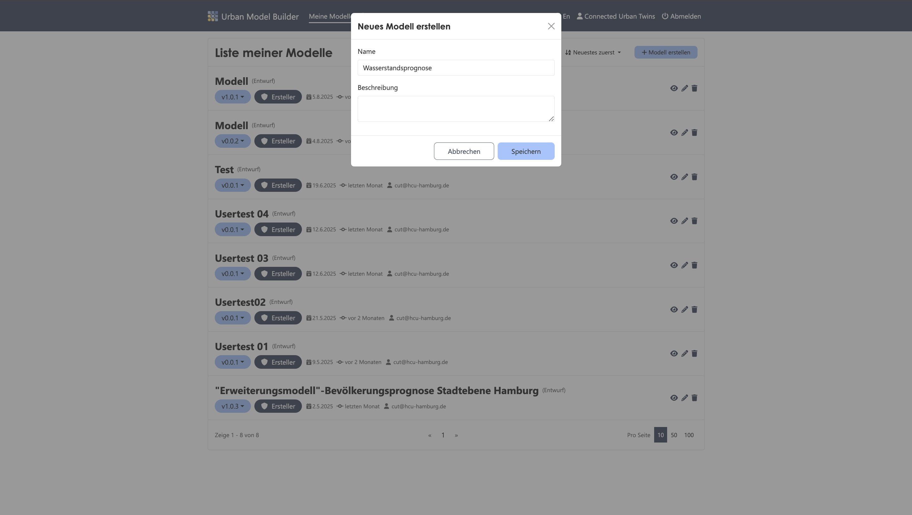
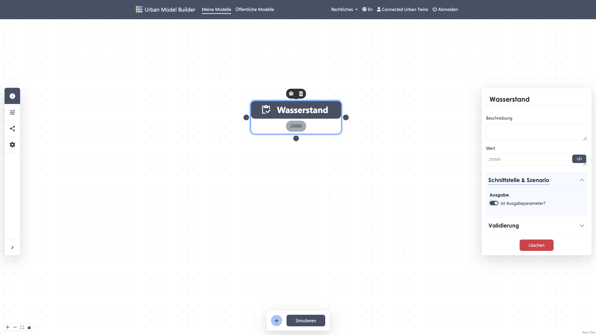
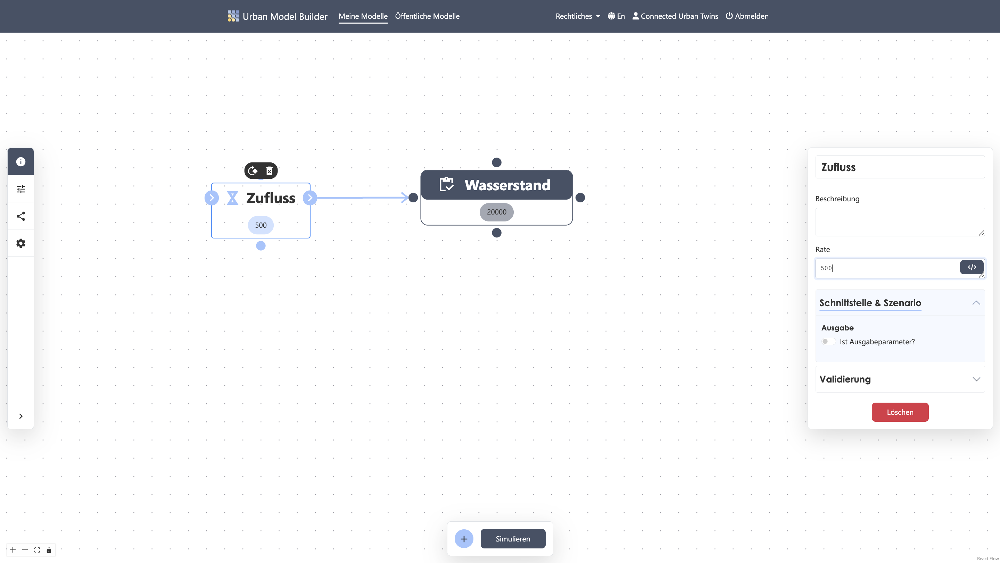
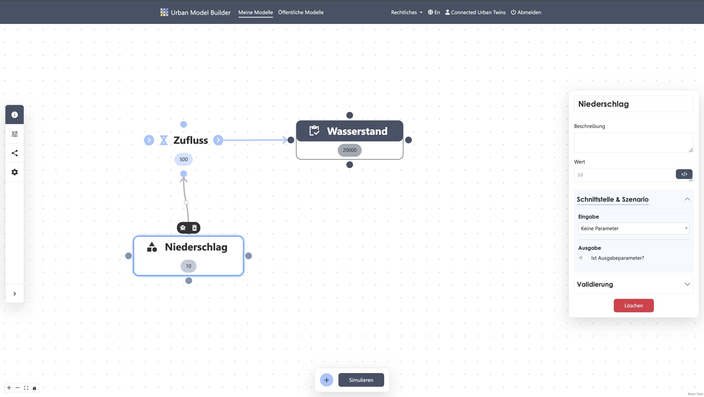
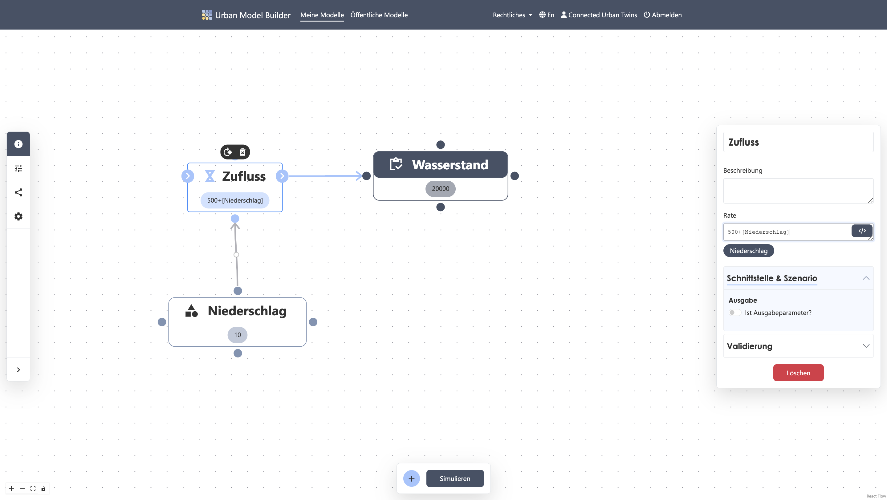
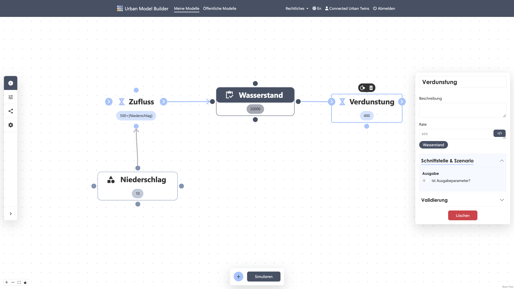
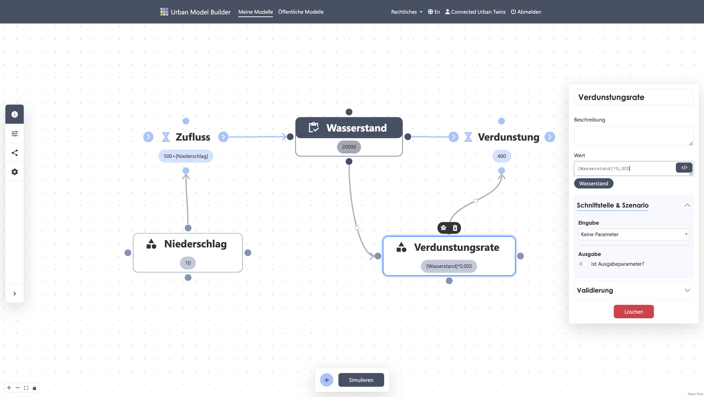
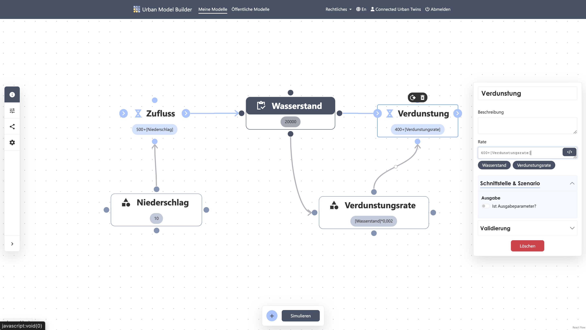
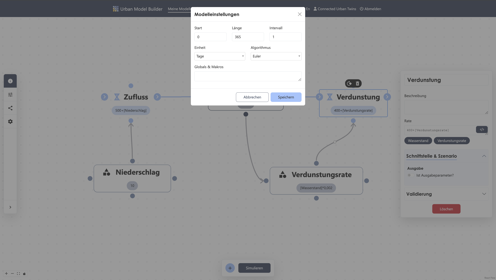
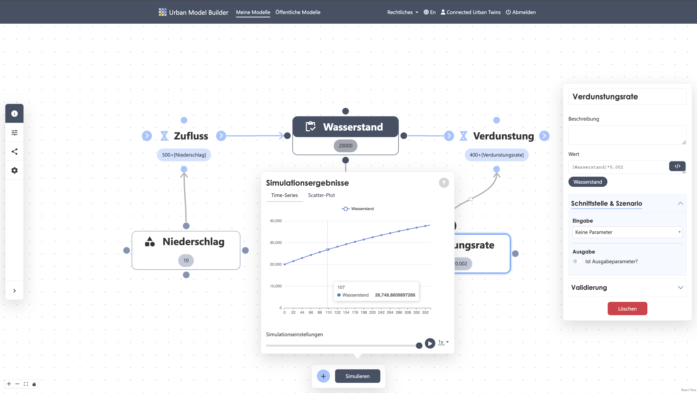

# System Dynamic Model

# Wasserstand mit Zufluss und Verdunstung
Stell dir vor, du möchtest wissen, wie sich die Wassermenge in einem See über einen bestimmten Zeitraum verhält. Durch Regen gelangt immer mal wieder Wasser hinzu, jedoch verdunstet auch eine gewisse Wassermenge bei ausreichender Sonneneinstrahlung. Konstante Zu- und Abflüsse gibt es natürlich auch durch kleine Wasser- und Bachläufe. Die folgende Schritt-für-Schritt- Anleitung zeigt dir, wie du in nur wenigen Schritten dein erstes System Dynamics Modell aufbaust!

---

# 1. Neues Modell
✔︎ Erstelle ein neues Modell und nenne es "Wasserstandsprognose"



---
# 2. Stock "Wasserstand" erstellen
✔︎ Füge einen Stock hinzu, welches du über das Plus-Icon in der Activbar findest

✔︎ Klicke auf den platzierten Stock und nenne ihn "Wasserstand"

✔︎ Setze einen Startwert in das Wert-Eingabefeld von bspw. ```20000``` m<sup>3</sup>

✔︎ Stelle den Stock als Output-Parameter ein



---
# 3. Inflow "Zufluss" anlegen
✔︎ Füge einen Flow hinzu und nenne ihn "Zufluss"

✔︎ Setze einen konstanten Wert von ```500``` m<sup>3</sup> pro Tag, ausgelöst durch einen Wasserlauf

✔︎ Verbinde nun den Ausgangs-Knotenpunkt des Flows mit einem Knotenpunkt des Stocks

✔︎ Achte darauf, dass der Verbindungspfeil zum Stock zeigt 



---
# 4. Variable "Niederschlag" erstellen
✔︎ Füge eine Variable mit dem Namen "Niederschlag" hinzu

✔︎ Setze zB einen konstanten Wert von ```10```<sup>3</sup> pro Tag

✔︎ Verbinde die Variable mit dem oberen oder unteren Knotenpunkt des Flows



---
# 5. Formel für Flow "Zufluss" setzen
✔︎ Öffne die Parameter Einstellung des Flows "Zufluss", indem du darauf klickst

✔︎ Addiere den Wert "Niederschlag" zu dem Wert des einströmenden Bachlaufs



---
# 6. Outflow "Verdunstung" anlegen
✔︎ Füge einen zweiten Flow hinzu und nenne ihn "Verdunstung"

✔︎ Setze einen konstanten Wert von ```400``` m<sup>3</sup> pro Tag, ausgelöst durch einen kleinen Bachlauf

✔︎ Verbinde nun einen Knotenpunkt des Stocks mit dem Eingangss-Knotenpunkt des Flows 

✔︎ Achte darauf, dass der Verbindungspfeil weg vom Stock zeigt



---
# 7. Variable "Verdunstungsrate" erstellen
✔︎ Füge eine Variable mit dem Namen "Verdunstungsrate" hinzu

✔︎ Setze sie abhängig vom Wasserstand zB ```Wasserstand * 0.002``` (-> 0,2% pro Tag)

✔︎ Verbinde die Variable mit dem oberen oder unteren Knotenpunkt des Flows "Verdunstung"



---
# 8. Formel für Flow "Verdunstung" setzen
✔︎ Öffne die Parameter Einstellung des Flows "Verdunstung"

✔︎ Addiere den Wert "Verdunstungsrate" zu dem Wert des ausströmenden Bachlaufs


---
# 9. Simulationseinstellungen
✔︎ Öffne die Modell Einstellung in der Sidebar 

✔︎ Setze die Werte wie folgt:
Start: 0
Länge: 365 
Intervall: 1 
Einheit: Tage 


---
# 10. Simulation starten 
✔︎ Starte die Berechnung der Simulation, indem du auf den "Simulieren"-Button in der Activebar klickst

