import Tabs from '@theme/Tabs';
import TabItem from '@theme/TabItem';

# Cheatsheet
<Tabs>
  <TabItem value="primitives" label="Primitives" default>

Here you can find all functional building blocks at a glance!

| Primitive     | Type | Meaning | Examples |
| ------------- | ---- | ------- | -------- |
|   | SD | <ol><li>Accumulated quantities or values that build up or deplete over time</li><li>Stores the current value at different calculation time steps</li><li>Changes through inflows or outflows</li></ol> | Population, water level, energy content | 
|   | SD | <ol><li>Describes the rate at which a stock increases or decreases</li><li>Changes the stock but does not store values itself</li><li>Can depend on other variables</li></ol> | Birth rate, water inflow, energy consumption | 
| 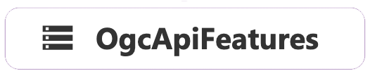  | Common | <ol><li>Modern standard by the Open Geospatial Consortium (OGC)</li><li>Provision and retrieval of geodata via web interfaces</li><li>Datasets from Geoportal via the Hamburg Masterportal</li></ol> | Census data, district data, infrastructure | 
|   | Common | <ol><li>Variable influencing factors</li><li>No value storage</li><li>Influences other calculation variables</li></ol> | — | 
| 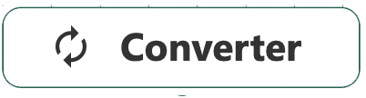  | Common | <ol><li>Performs a calculation, transformation, or derivation from other variables or constants</li><li>Similar to a helper variable; does not store values but is recalculated at each simulation time step</li><li>Graphically represents input–output relationships</li></ol> | — |
| 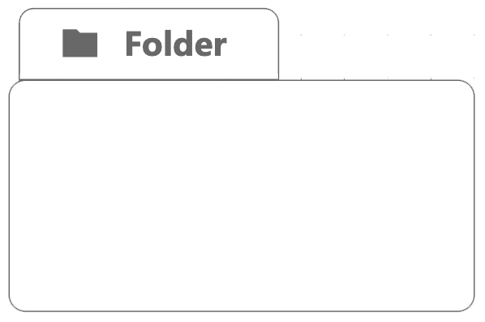  | Common | <ol><li>Structural element that simplifies model organization</li><li>Selected model parts can be collected, grouped, and moved</li></ol> | — |
|   | ABM | <ol><li>Represents the current situation or configuration of an agent, influencing its behavior</li><li>State changes are triggered by rules, probabilities, or environmental factors</li></ol> | At home, at work, in quarantine |
|   | ABM | <ol><li>Represents transitions between states of an agent</li><li>Defines when and under what conditions an agent should change states</li></ol> | Healthy → infected, undecided → convinced, moving to another city |
|   | ABM | <ol><li>Concrete actions performed by an agent during a state or during a state transition</li><li>Describe operational behavioral rules, e.g., moving, interacting with other agents, consuming resources</li></ol> | Get vaccinated, find the nearest bike station, influence other agents |
| 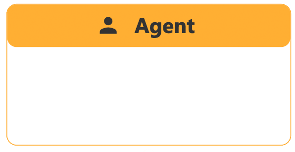  | ABM | <ol><li>An autonomous entity with its own states, properties, and behavioral rules</li><li>Can interact with its environment and other agents</li><li>Can make independent decisions, act state-dependently, change over time, and interact locally</li></ol> | Car in traffic, consumer in a market model, machine in a factory |
|   | ABM | <ol><li>The total set of agents of a certain type within a model</li><li>Agents share common characteristics or behavioral types</li></ol> | Residents in a city, vehicles on a road, trees in a neighborhood |

  </TabItem>
  <TabItem value="interface" label="Interface">

Here you can find all interface components at a glance!

| Interface    | Component | Functions |
| ------------ | --------- | --------- |
| 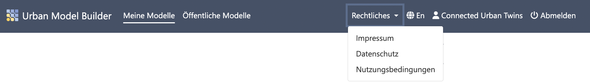  | **Navibar** | <ol><li>Return to home screen</li><li>List my models</li><li>List public models</li><li>Legal documents</li><li>Language switch (DE/EN)</li><li>User account name</li><li>Log out</li></ol> |
| 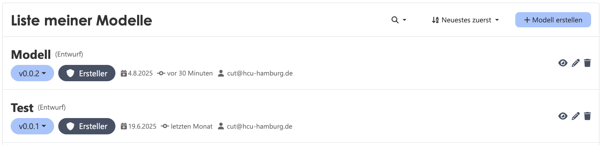  | My Models | <ol><li>Search function</li><li>Filter function</li><li>Create new model</li><li>Open model</li><li>Edit model name & description</li><li>Delete model</li></ol> |
| 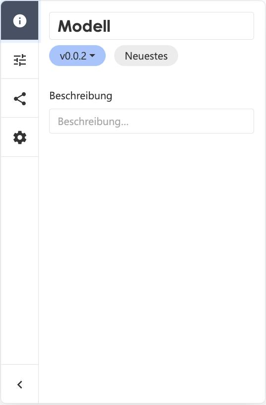  | **Sidebar** | <ol><li>Model information</li><li>Scenario settings</li><li>Version settings</li><li>Model settings</li></ol> |
| 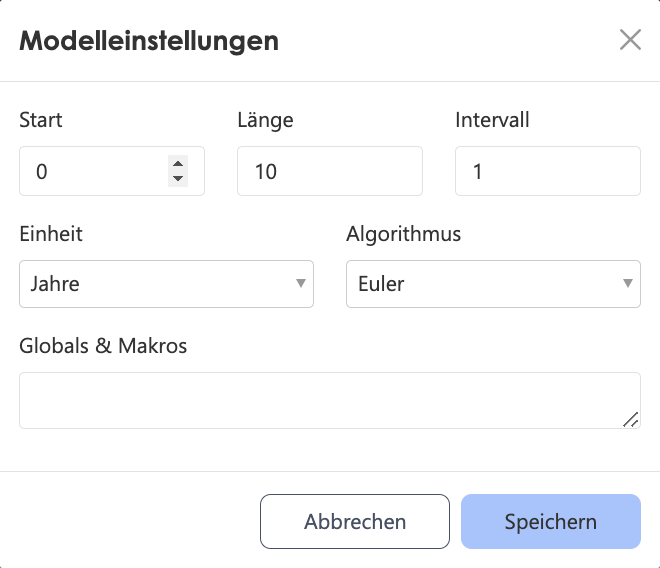  | Model Settings | <ol><li>Simulation start time</li><li>Simulation duration</li><li>Time intervals</li><li>Time unit</li><li>Computation algorithm</li><li>Globals & Macros</li></ol> |
| 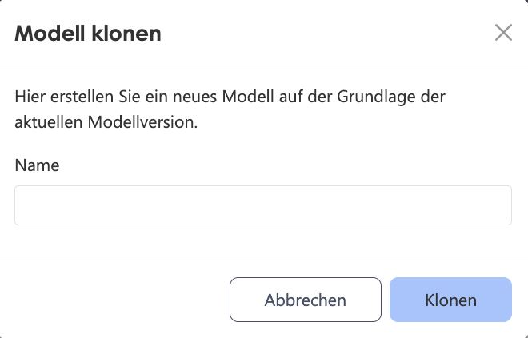  | Clone Model | <ol><li>New model name</li></ol> |
| 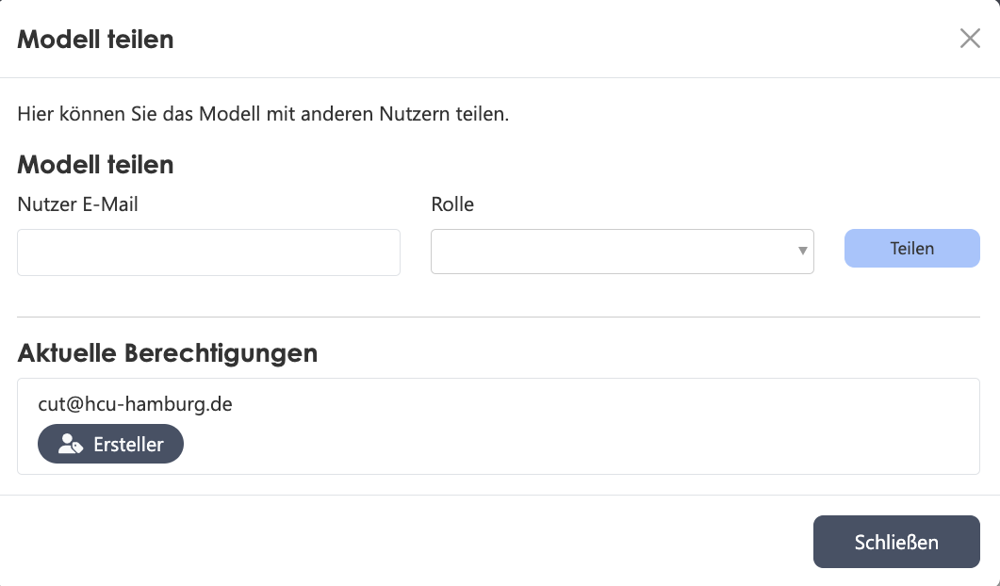  | Share Model | <ol><li>Recipient email address</li><li>Assigned role</li></ol> |
|   | Publish Model | <ol><li>Version type</li><li>Publish as model server endpoint</li><li>Notes</li></ol> |
| 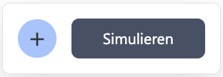  | **Activebar** | <ol><li>Primitives</li><li>Run simulation</li></ol> |
| 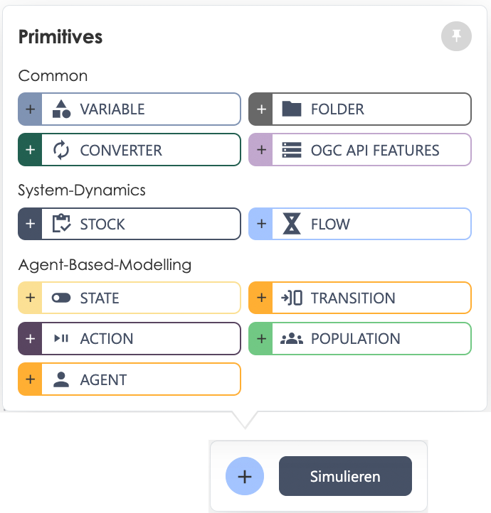  | Primitives | <ol><li>11 functional building blocks</li><li>Pin-to-screen function</li></ol> |
| 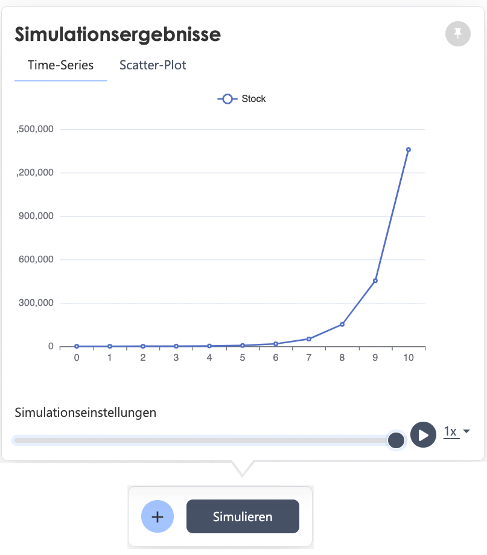  | Simulation Results | <ol><li>Display results in line or scatter chart</li><li>Pin-to-screen function</li><li>Speed settings</li></ol> |
| 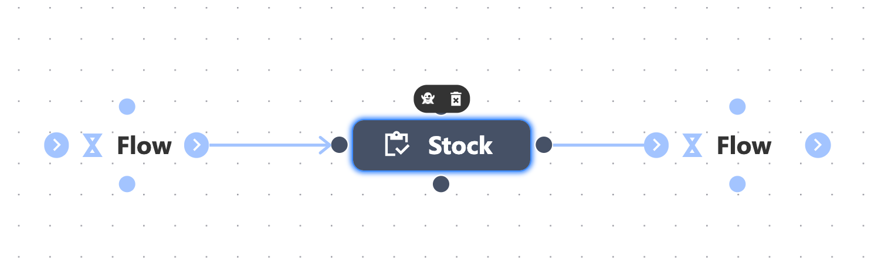 | Canvas | <ol><li>Workspace for placing primitives</li><li>Graphically connect primitives / create & delete ghost variables</li></ol> |
| 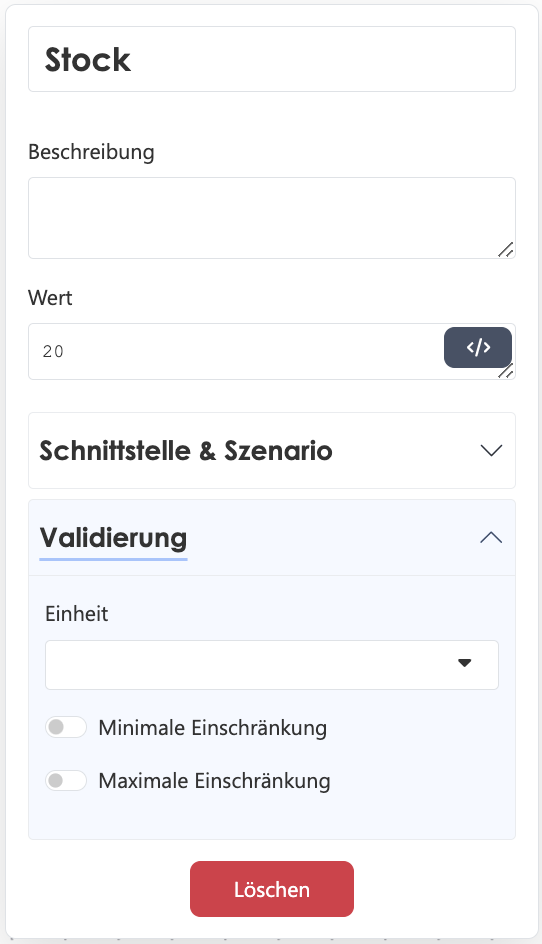  | Primitive Settings Window | <ol><li>Settings for the respective primitive</li><li>Interface & scenario settings</li><li>Validation</li></ol> |
| 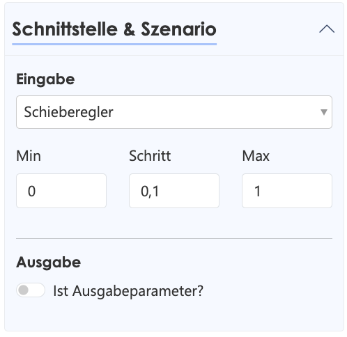 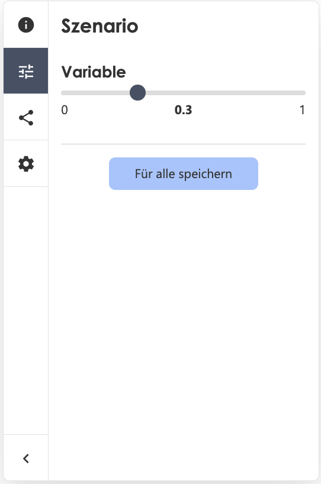  | Scenario Settings | <ol><li>Parameter in primitive settings window</li><li>Scenario settings in the sidebar</li></ol> |

  </TabItem>
  <TabItem value="glossar" label="Glossary">

Here you’ll find some important definitions at a glance!

| Term | Definition |
| ---- | ---------- |
| Model | A simplified, abstract representation of a real or imagined system that approximates certain aspects of the system depending on its purpose. Models can be physical, conceptual, or mathematical. |
| Model Structure | The formal organization of a model, consisting of equations, dependencies (SD) or states, rules, and interactions (ABM). Defines the functional logic of the system. |
| System Dynamics | A model-based approach to studying and describing complex, feedback-driven systems using stock and flow variables. Particularly suited for aggregated, long-term developments. |
| Agent-Based Modeling | Simulates systems through the interaction of many individual, autonomous agents, each following its own rules and goals. Suitable when individual behavior and interactions are key to system dynamics. |
| Causal Diagram | A visualization of cause–effect relationships, often used as a precursor or documentation for SD models. Shows qualitative system connections. |
| System Boundary | Defines the limits of the modeled system relative to its environment, determining which variables are included or excluded. |
| Simulation | Examining a system over time to analyze the behavior of a real or digital model under specific conditions. |
| Initialization | Defining the initial conditions of a model (e.g., start values, configurations). Essential for reproducibility and comparability. |
| Discretization | Converting continuous processes into discrete time steps (especially in SD models), affecting numerical accuracy and runtime. |
| Agent Interaction | In ABM: explicit coupling of agents via spatial proximity, rules, networks, or messaging. Leads to emergent behavior. |
| Rule-Based Modeling | Modeling approach where decisions or state transitions follow explicit rules. Common in ABM, especially for state transitions. |
| Dynamic Feedback | Circular causal relationships that evolve over time. In SD: positive feedback leads to growth, negative to stabilization. |
| Scenario Management | Methodical definition, execution, and evaluation of various future developments. In SD: via parameter combinations; in ABM: also via alternative rule sets. |
| Robust Decision Support | Identifying strategies that remain effective under high uncertainty and many possible futures (e.g., Robust Decision Making). |
| Calibration | Adjusting model parameters to empirical data to optimize the match to observed reality. |
| Verification | Technical check to ensure the model is implemented correctly — “Are we building the model right?” e.g., debugging, unit testing, source code review. |
| Validation | Assessing whether the model is consistent with the real system — “Are we building the right model?” e.g., expert feedback, data comparison, retrodiction. |
| Hybrid Modeling | Combining different modeling paradigms (e.g., SD+ABM) to capture both individual and systemic dynamics. |
| API (Application Programming Interface) | A standardized interface for software components to communicate. Defines how functions, data, or services are accessed and used by other applications without exposing internal structures. |
| Model Evaluation | Holistic assessment of a model in terms of assumptions, logic, results, plausibility, transparency, and applicability. |
| Behavioral Assumptions | Theoretically or empirically derived hypotheses about how actors make decisions or change states. Critical in ABM. |
| Versioning | Traceable storage of model development stages (e.g., via Git). Essential for reproducibility and collaboration. |
| Model Transparency | The degree to which a model, its structure, and assumptions are openly documented and made understandable — a foundation for trust and reuse. |

  </TabItem>
</Tabs>
