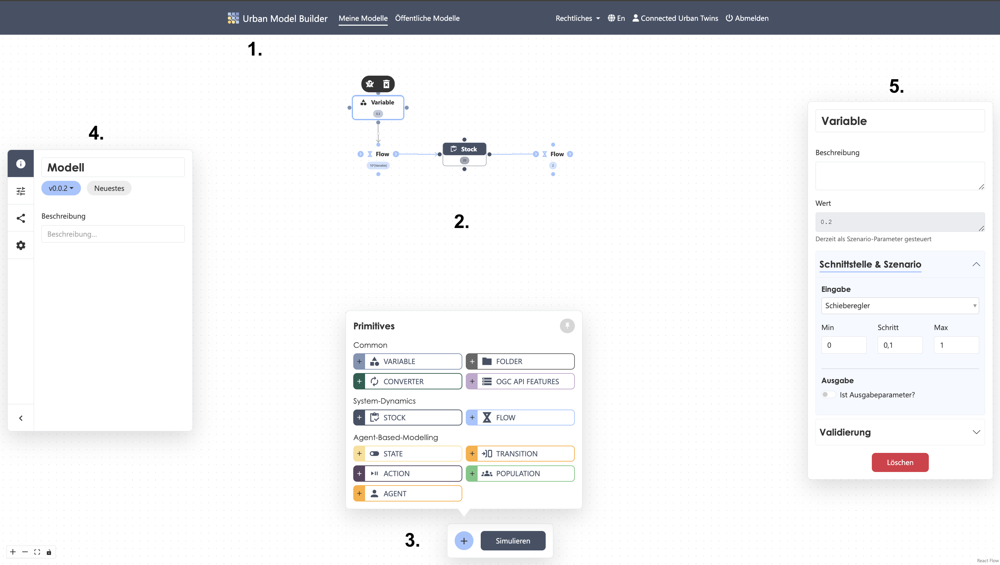

# Interface

## Structural Elements

### 1. NaviBar
In addition to the **Urban Model Builder** menu item, which takes you to the home page, the top navigation bar contains two overview lists: one for your private models and one for all published models.  
If you publish a model, it will appear in **both** lists.  
The list includes key tags and details such as the number of model versions and their status, your role, creation date, and last modification date.  
Using the icons next to each entry, you can open a model, edit its name and description, or delete it.  

:::warning
Deleting model data is permanent and cannot be undone.
:::

The **Legal** drop-down menu provides information about privacy, terms of use, and contact details (imprint) at any time.  
The Urban Model Builder is available in both German and English.  
You can log out manually via the **Log Out** menu item. If no requests are sent to the server for a while, your account will be logged out automatically.

---

### 2. Canvas
The workspace of the Urban Model Builder is an unlimited two-dimensional canvas you can freely navigate.  
It is the central modeling area where the model is built visually, and where elements are placed and connected.  
The interface is divided into the following main areas:

---

### 3. ActiveBar
At the bottom center of the workspace is the **ActiveBar**, which contains two of the tool’s core functions:  
- The eleven primitives (accessible via the **plus button**)  
- The **Simulation** button to start calculations  

You can pin the primitives window for a smoother workflow. Clicking a primitive places it in the center of the canvas.

---

### 4. SideBar
On the left side of the workspace is a collapsible **SideBar** containing higher-level settings, including:  
- General model information (name, version number, description)  
- [Scenario settings](./Einstellungen/Szenario-%20Einstellungen.md)  
- [Version settings](./Einstellungen/Versions-Einstellungen.md)  
- Global [model settings](./Einstellungen/Modell-%20Einstellungen.md)  

---

### 5. Primitive Settings Panel
Clicking a primitive opens its **settings panel** on the right-hand side of the workspace, where you can edit its parameters.  
For detailed information about input types and parameter meanings, see [Primitives](Primitives.md).

---

## Usage

### 1. Placing Elements
Select a modeling element from the ActiveBar at the bottom. It will automatically be placed on the canvas.  

:::tip Tip
You can create a **ghost variable** of a primitive by selecting it and clicking the ghost icon.  
This helps organize your model and place primitives elsewhere without creating long, messy connections.
:::

---

### 2. Connecting Elements
To define dependencies, connect elements visually:  
Hover over a node on the source primitive until it becomes a crosshair, hold the left mouse button, and drag to a node on the target primitive.  
The connection appears as an arrow showing the direction of dependency. The primitive the arrow points to will use the other’s value as input.  

:::tip Tip
For *Flow* and *Transition* primitives, node functions are predefined, and direction is indicated by input/output arrows.  
You can reverse the direction by selecting the primitive and clicking the rotate icon.
:::

---

### 3. Setting Parameters
Once an element is selected, you can set parameters in the properties panel.  
Enter your own equations or use built-in functions.  
If connected, you can use the linked primitive’s value as input by clicking the button below the value input field.

:::tip Tip
Make sure the primitive name and the label inside square brackets in the value field match exactly (including spaces).  
If you rename a primitive during modeling, update the names in the value fields; otherwise, the model will not run.
:::

:::warning
Clicking **Delete** in the properties panel removes the **entire primitive**, not just its field contents.  
Deleting a primitive is irreversible.
:::

---

### 4. Running a Simulation
Click **Simulate** to calculate the model using the set parameters.  
A new window will appear in the center of the workspace showing the results as either a line chart or a scatter plot.  
You can adjust the display speed of the simulation.
