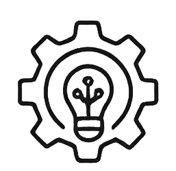
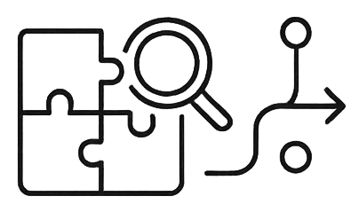
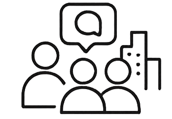
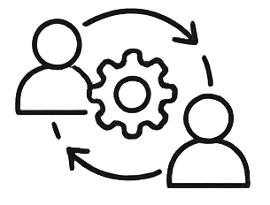

# Next Steps

## Outlook
Looking toward the future, we hope that ...

... the Urban Model Builder will serve as an inspiring platform to advance the approach of co- and multi-modelling.

... the tool’s versatility will foster a diverse landscape of models for exploring “what-if” scenarios.

... data exchange and communication between interdisciplinary teams and fields of expertise will be strengthened.

... the integration of additional API interfaces will help break open closed data silos and increase the number of interoperable use cases.

... public interest in participating in urban development processes will grow.

... collaborative work will lead to reflection on, questioning of, and improvements to existing processes.
