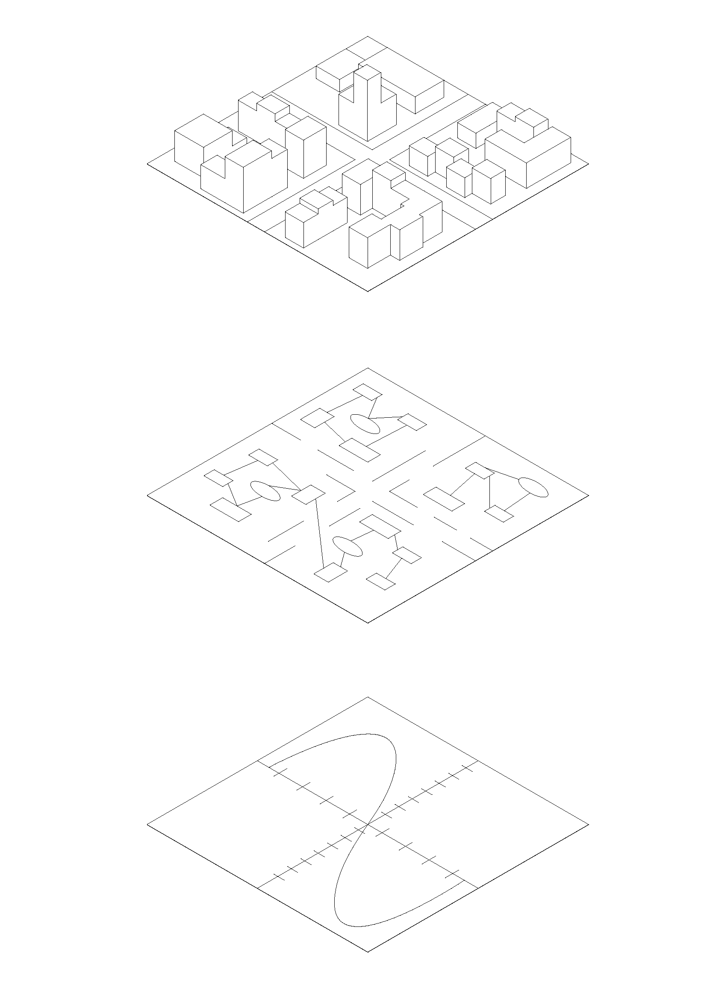

# System Dynamics & Agent-Based Models

## City Level

Cities are complex, adaptive, and dynamic systems with numerous dynamics and causal dependencies.  

To approximate these multiple subsystems, **System Dynamics** models are often used.  
System Dynamics is a model-based simulation method rooted in general systems theory and cybernetics.  
It takes a **top-down** perspective on the behavior of complex systems, focusing on delayed cause–effect relationships and feedback loops between variables.  
Rather than analyzing linear cause–effect chains, System Dynamics considers a system’s causalities and their behavior holistically over time.  
Key elements include feedback loops, stock variables (stocks), and flow variables (flows).  
The method was developed in the 1950s by Jay W. Forrester.  
Further reading on System Dynamics can be found [here](https://books.open.tudelft.nl/home/catalog/book/179).

Another simulation approach is the **agent-based model** (ABM).  
Here, the behavior of complex systems is approached with a **bottom-up** method.  
On the city level, individual actors — called *agents* — are modeled as autonomous entities in a multi-agent environment.  
The interactions between agents influence each other, and simulations can provide insight into **emergent phenomena**.  
More on ABM can be found [here](https://link.springer.com/book/10.1007/978-94-007-4933-7).

---

## Process Level

Looking beneath the city level reveals a network of interconnected processes.  
For certain questions and problems, it is necessary to analyze these networks to understand and represent the logic of operations.  
As with process diagrams, these models consist of functional building blocks, each mathematically computed and simulated.  
Within a model, these blocks can be considered the smallest units of analysis, simulating different futures — the familiar “what-if” scenarios.

### System Dynamics
In **System Dynamics**, the smallest modeling elements typically include stocks and flows, complemented by feedback loops and time delays.  
These elements describe continuous, aggregated changes in a system — for example, the evolution of a population over time.

### Agent-Based Models
In contrast, **agent-based models** are composed of many individual, often heterogeneous agents as the smallest units.  
Agents have their own rules, decision-making logics, and behaviors, and they interact with both their environment and each other.  
The model’s behavior emerges from the micro-level actions of the agents — from the interactions of many small units.

---

## Computation Level

### System Dynamics
Differential equation systems are the computational foundation of **System Dynamics**, as they model time-dependent changes in the state variables of a dynamic system.  
A system of differential equations consists of several coupled equations describing how state variables change over time:

$$\frac{dx_n}{dt} = f_n(x_1, x_2, \ldots, x_n, t)$$

Each equation defines the rate of change of a state variable $x_i$ per unit of time, depending on other variables.

- **Stocks** – State variables $x_n(t)$  
- **Flows** – Rates of change $\frac{dx_n}{dt}$  
- **Feedback loops** – Coupling between equations (e.g., $f_n$ depends on $x_n$)  
- **Simulation** – Numerical solution of these equations over time  

---

### Agent-Based Models
In **agent-based models**, instead of global equations for the entire system, the behavior of individual autonomous agents is described.  
Agents follow defined rules to interact with their environment and influence one another.  
The global system behavior emerges from the interactions of many individual agents.

Agent-based models generally do not rely on differential equations, but on **rule-based systems** such as logical decision rules, discrete-time simulations in sequential steps, stochastic processes (e.g., transition probabilities between states), or event-based modeling of individual agent states.  
Because results depend on the specific sequence of agent interactions, they cannot be deterministically predicted and require multiple simulation runs to build a complete picture.
