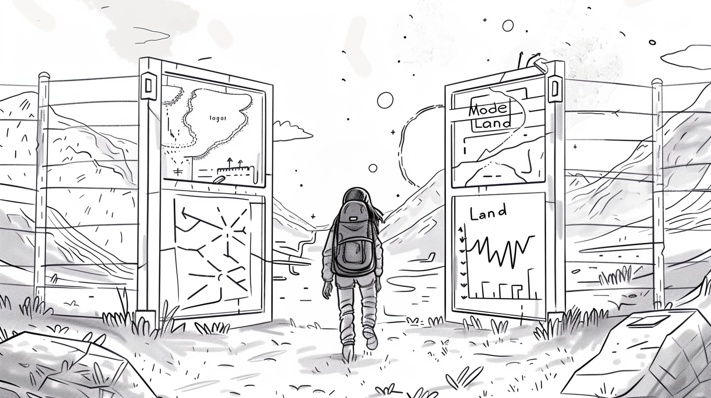

# Leaving Model Land

## Interpreting Model Results

At some point, it’s time to return.  You’ve seen and experienced much, simulated possible futures [(Run a Simulation)](../Simulation%20durchführen.md), and gathered insights. But the decisions you need to make are waiting for you back home.  

The knowledge you’ve gained in Model Land is plentiful — and hopefully useful!  Now, the assumptions you encoded at the beginning must be decoded again, made applicable to the real world, and transferred into action.

You open your travel diary:

- **Quantitative results** — your calculations, your data, your model versions — are made openly available. But you know that numbers alone aren’t enough.

So, you tell stories:

- **Qualitative narratives** that embed your findings in context, assumptions, and uncertainties. You explain why you made certain choices and what others might see in them.

You remember your responsibility:  Many people rely on your models. It’s important to describe your Model Land as clearly as possible to avoid misunderstandings and unrealistic expectations.

You explain not only the results but also the limitations. Through different scenarios and model versions, you show that there is never just one path.
With new model drafts, you come to understand that a system can be described in many ways — at different scales, levels of detail, complexities, and focal points.  

They may build on the assumptions of other users, be reshaped by your worldview, and in turn inspire others to begin their own journey into Model Land.

Are you ready for your adventure?

