# Agent-Based Model

# Disease Spread
Imagine you want to simulate how a pathogen spreads within a population over a certain period of time. Agents influence each other — they infect one another when they meet by chance. States constantly change from "susceptible" to "infected" to "recovered." The following step-by-step guide shows you how to build your first agent-based model in just a few steps!

---
# 1. Create a new model
✔︎ Create a new model and name it "Disease Spread"

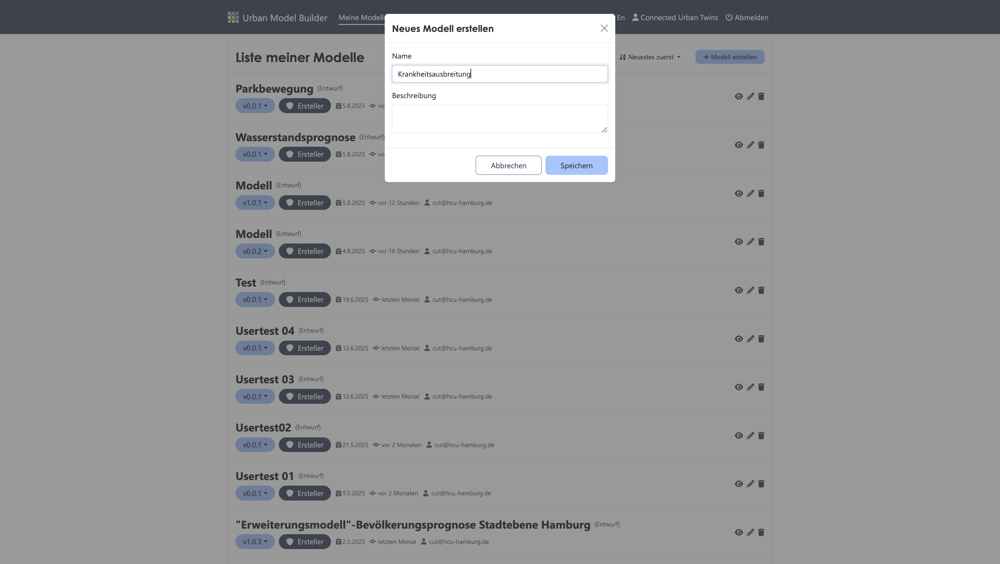

---
# 2. Create agent type "Person"
✔︎ Add an agent and name it "Person"

✔︎ Resize the primitive's window on the canvas to fit the next primitives inside

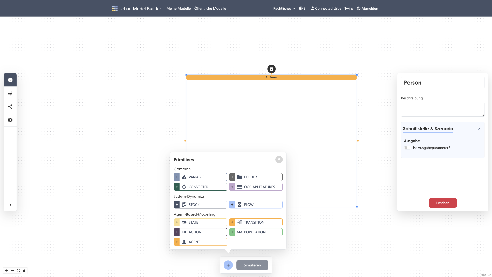

---
# 3. Create state "susceptible"
✔︎ Add a state to the "Person" agent and name it "susceptible"

✔︎ At the start time, this state is correct, so set the parameter to ```true```

✔︎ Holding time: ```0```

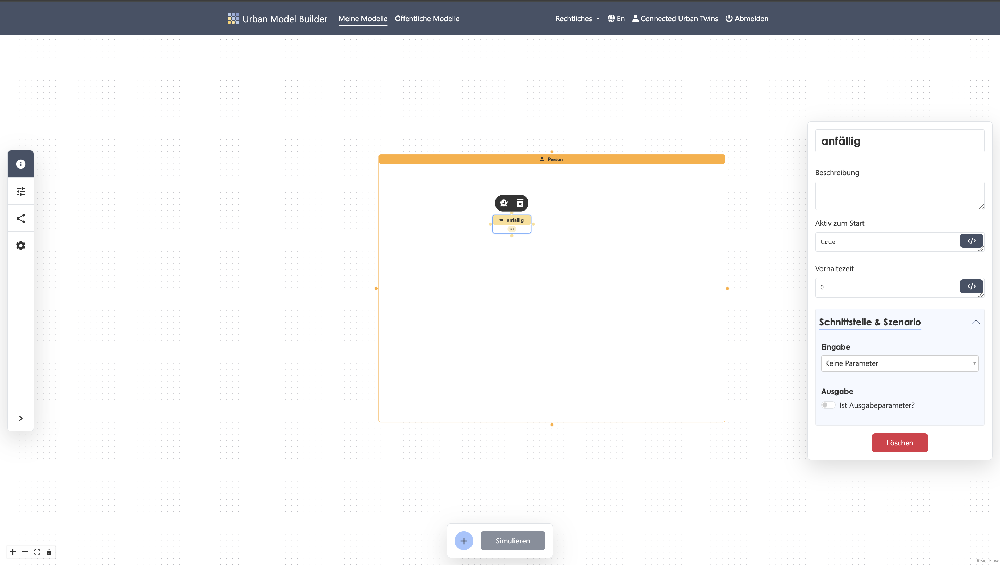

---
# 4. Create state "infected"
✔︎ Add a state to the "Person" agent and name it "infected"

✔︎ Connect the "susceptible" state to the "infected" state

✔︎ At the start time, this state is ```not [susceptible]```. You can use the value from the connected "susceptible" primitive

✔︎ Holding time: ```0```

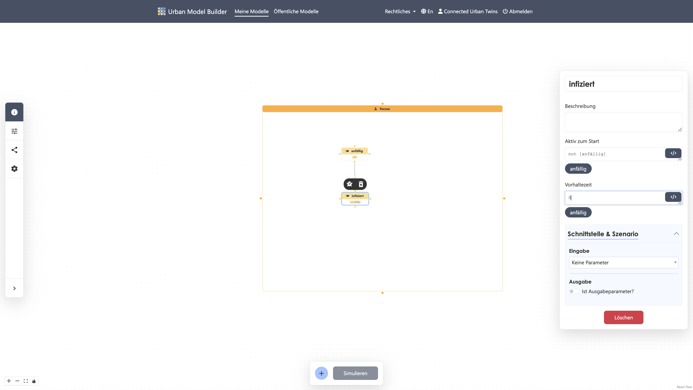

---
# 5. Create state "recovered"
✔︎ Add a state to the "Person" agent and name it "recovered"

✔︎ At the start time, this state is false, so set the parameter to ```false```

✔︎ Holding time: ```0```

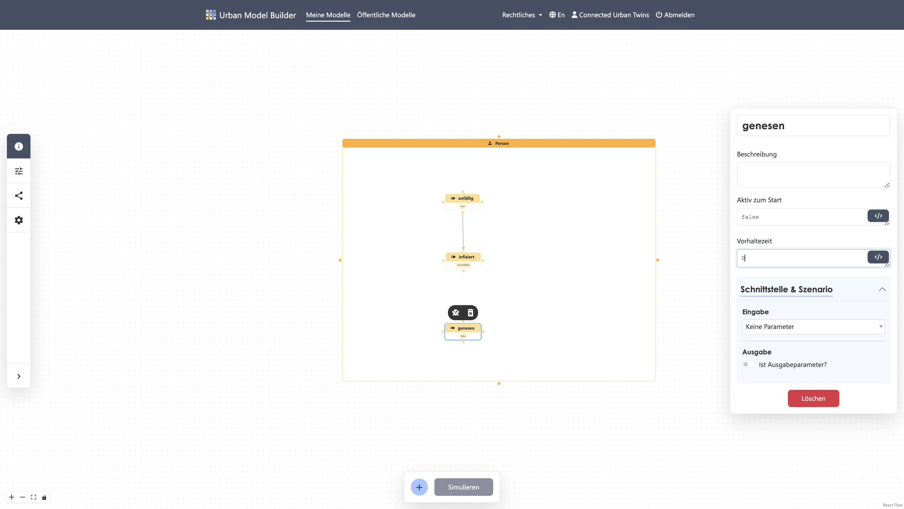

---
# 6. Create transition "Pathogen"
✔︎ Add a transition to the "Person" agent and name it "Pathogen"

✔︎ Connect the "susceptible" state to the "infected" state via this transition

✔︎ The trigger is a "Condition" caused by contact with other agents after 5 years

✔︎ Set value to ```Self.Index()=1 and Years=5```

✔︎ Recalculate value at every time step

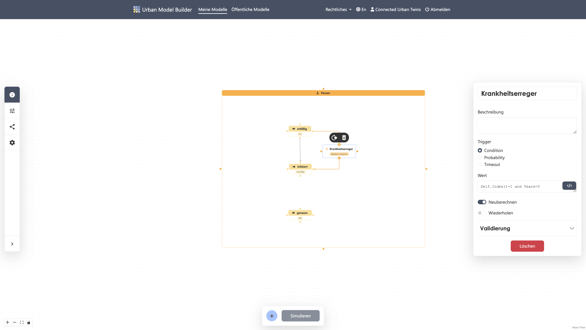

---
# 7. Create transition "Recovery"
✔︎ Add a transition to the "Person" agent and name it "Recovery"

✔︎ Connect the "infected" state to the "recovered" state via this transition

✔︎ The trigger is "Probability". The assumption is that 9% of infected individuals recover per time step.

✔︎ Set value to ```0.09```

✔︎ Recalculate value at every time step

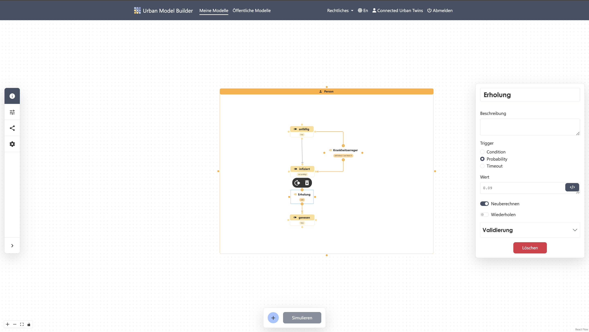

---
# 8. Create transition "Transmission"
✔︎ Add a transition to the "Person" agent and name it "Transmission"

✔︎ Connect the "susceptible" state to the "infected" state via this transition

✔︎ The trigger is "Probability". The probability of infection depends on the population, which we will model later.

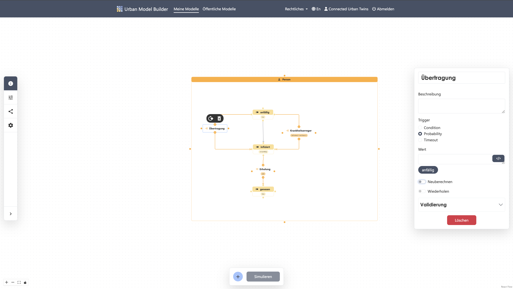

---
# 9. Create action "Catch Pathogen"
✔︎ Add an action to the "Person" agent and name it "Catch Pathogen"

✔︎ Connect the "susceptible" state to this action

✔︎ The trigger is a "Condition" that also depends on the population we will model next.

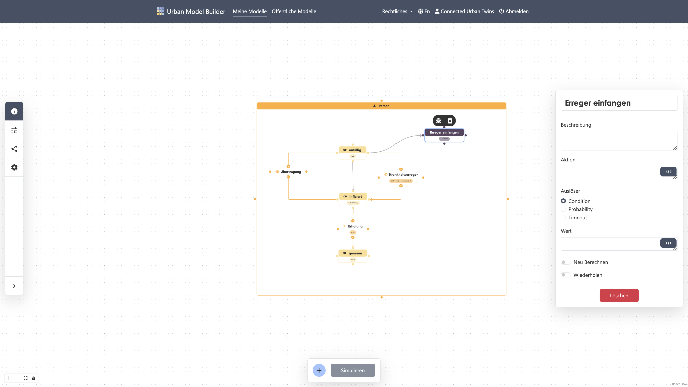

---
# 10. Create population
✔︎ Add a population that applies the agent "Person" behavior to the entire population

✔︎ Set values as follows:

Population size: ```100```  
Geo width: ```200```  
Geo height: ```200```  
Geo placement: "Random"  
Network type: "none"

✔︎ Set population as output parameter

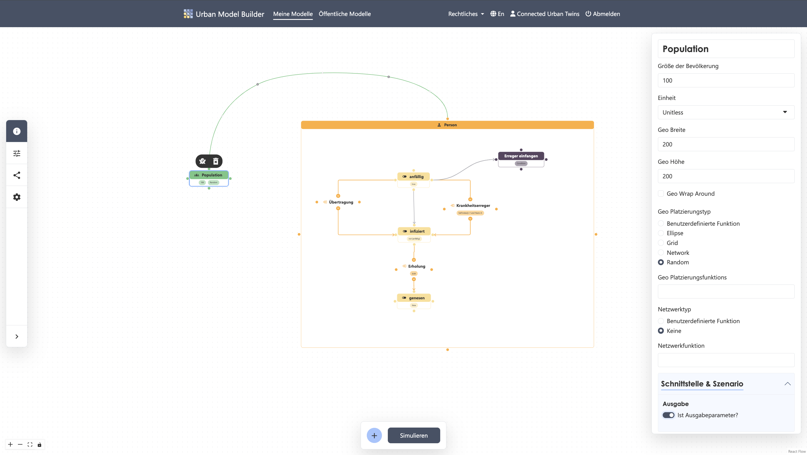

---
# 11. Equations for action "Catch Pathogen"
✔︎ Connect the population to the "Catch Pathogen" action in the "Person" agent

✔︎ Set action function to ```Self.moveTowards([Population].FindState([infected]).FindNearest(Self), -0.5)```

✔︎ Set condition to ```[susceptible] and [Population].FindState([infected]).count()> 0```

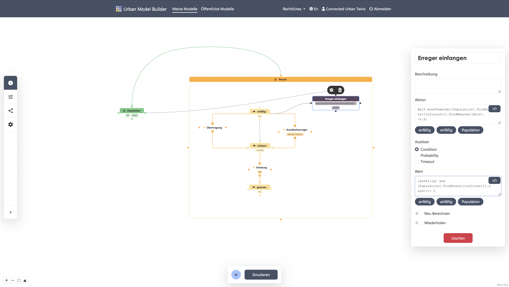

---
# 12. Equations for transition "Transmission"
✔︎ Connect the population to the "Transmission" transition in the "Person" agent

✔︎ Set value to:
```
infectors <- [Population].FindState([infected]).FindNearby(Self, 25)
probInfect <- min(1, infectors.Map(1/(distance(x, Self))^.75))
1 - Product(Join(1, 1 - probInfect))
```

✔︎ Recalculate value at every time step

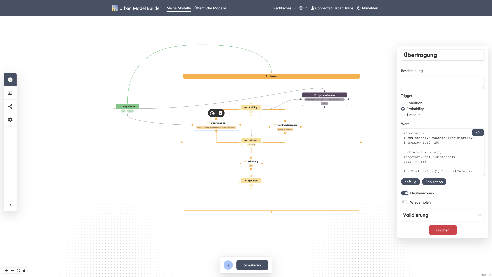

---
# 13. Create variable "Percentage Infected"
✔︎ Add a variable named "Percentage Infected"

✔︎ Connect the population to this variable

✔︎ Set value to ```[Population].FindState([infected]).Count()/[Population].FindAll().Count()*100```

✔︎ Set variable as output parameter

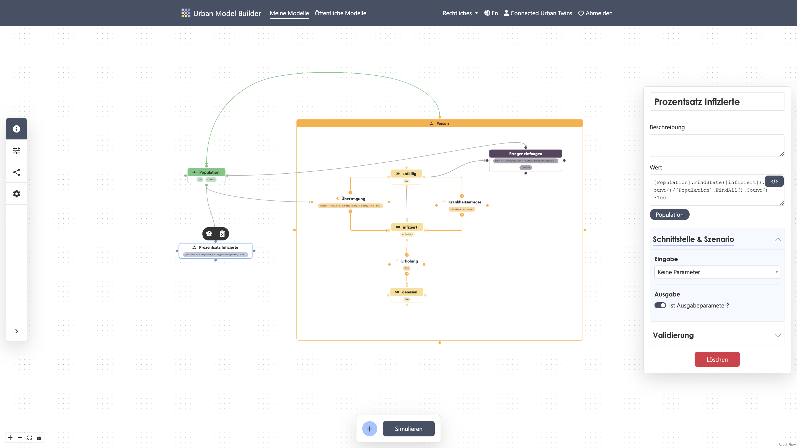

---
# 14. Simulation settings
✔︎ Open model settings in the sidebar

✔︎ Set values as follows:

Start: 0  
Length: 20  
Interval: 1  
Unit: Years

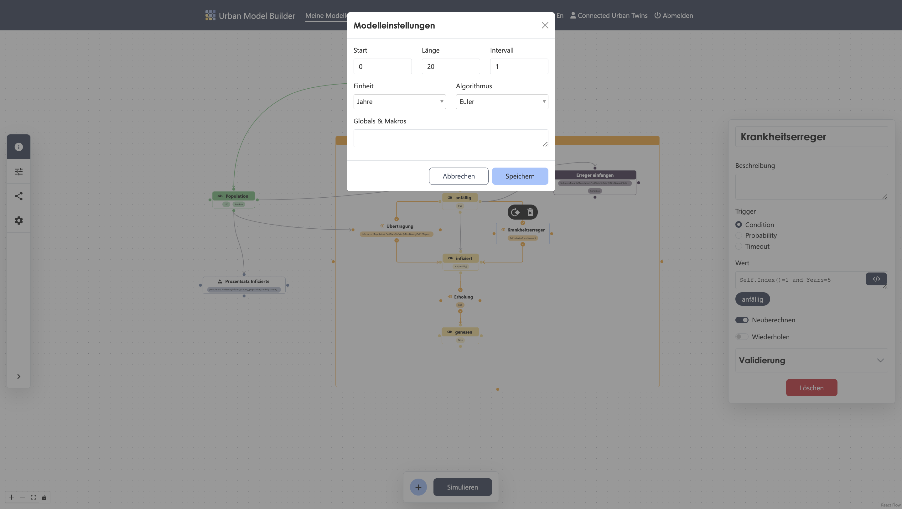

---
# 15. Run simulation
✔︎ Start the simulation by clicking the "Simulate" button in the Activebar

✔︎ View the scatter plot by clicking the "Scatter-Plot" tab

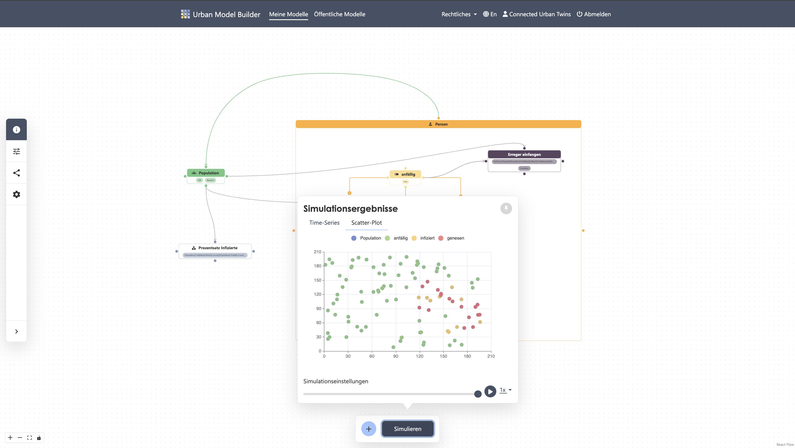

Your first agent-based model is complete!
