# OGC API Feature

# Population Forecast Hamburg
Imagine you want to know how the population in Hamburg might change in the coming years. As an initial value, you take the real dataset from the latest census of 2023. Through growth based on birth rates and decreases due to deaths in 2023 in Hamburg, the system changes dynamically over time. The following step-by-step guide shows you how to build your first System Dynamics model with a real dataset feature in just a few steps!

---
# 1. New Model
✔︎ Create a new model and name it "Population Forecast Hamburg"

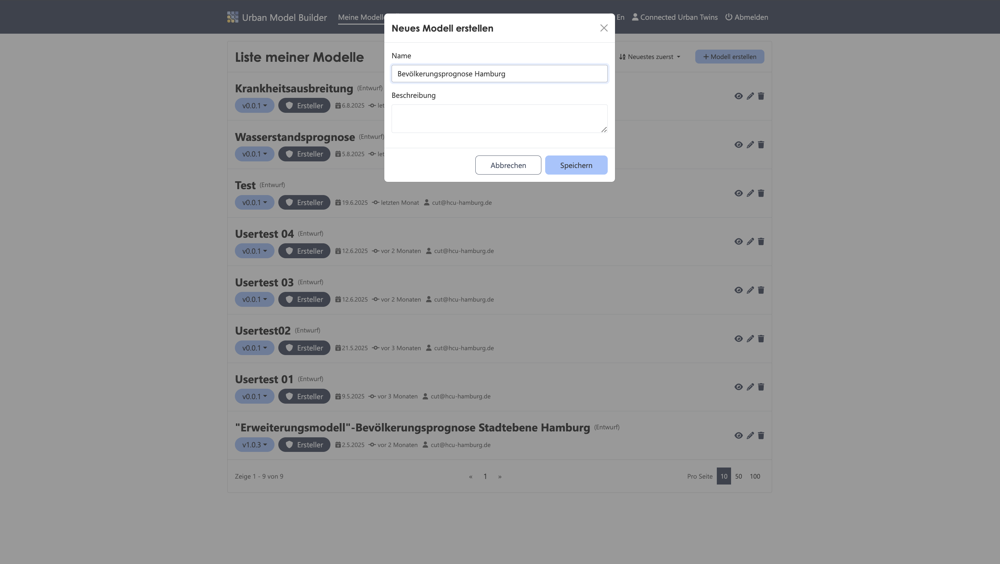

---
# 2. Create Stock "Current Population"
✔︎ Add a stock, which you can find via the plus icon in the active bar

✔︎ Open the parameter settings of the placed stock by clicking on it and name it "Current Population"

✔︎ Set the stock as an output parameter

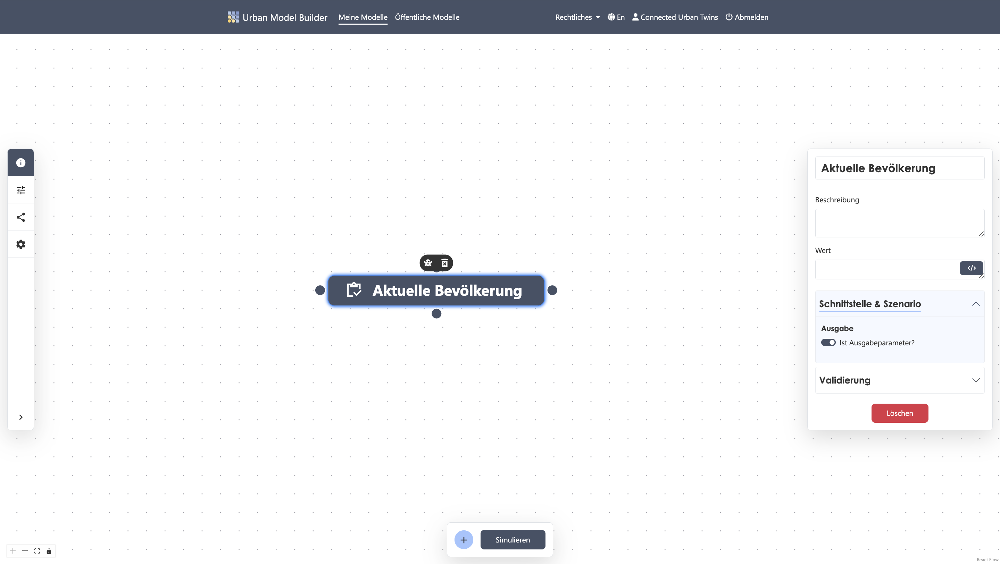

---
# 3. Create OGC API Feature "Population Dataset 2023"
✔︎ Add an OGC API feature and name it "Population Dataset 2023"

✔︎ Select "Regional Statistical Data of Hamburg Districts and Hamburg Overall" under APIs

✔︎ Select "Regional Statistical Data Hamburg Overall" under Collection

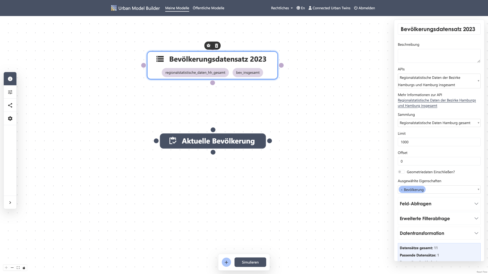

✔︎ Set the following values under **Field Query**:

Query Field:```Year```
Operator:```=```
Query Value:```2023```

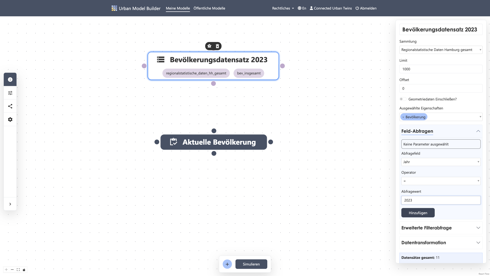

✔︎ Set the following values under **Data Transformation**:

Key Field:```Population```
Value Field:```Population```

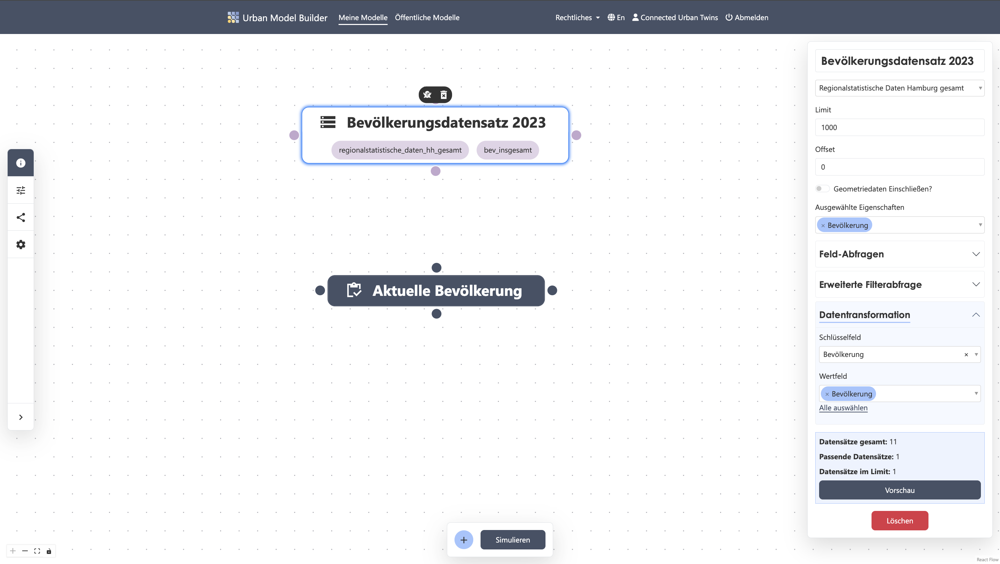
---
# 4. Create Connection to Stock "Current Population"
✔︎ Now connect the output node of the API feature "Population Dataset 2023" to a node of the stock "Current Population"

✔︎ Open the parameter settings of the stock "Current Population" by clicking on it

✔︎ Add the value ```[Population Dataset 2023]``` by clicking the button under the value field
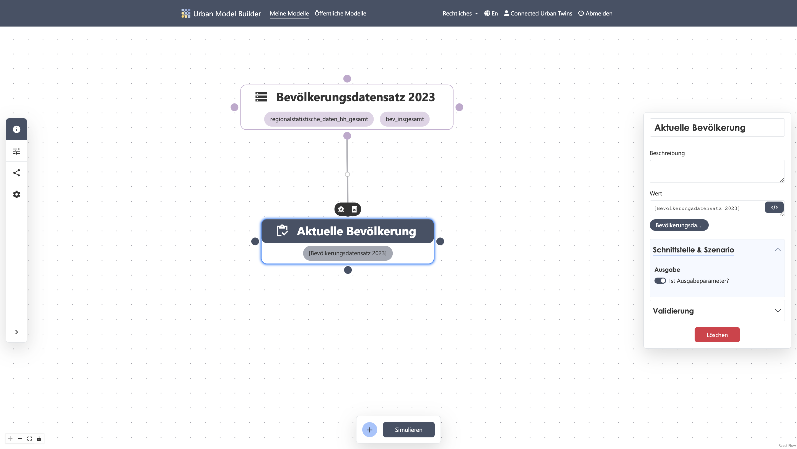

---
# 5. Inflow "Growth" create
✔︎ Add a flow and name it "Growth"

✔︎ Now connect the output node of the flow to a node of the stock "Current Population"

✔︎ Make sure that the connection arrow points to the stock 
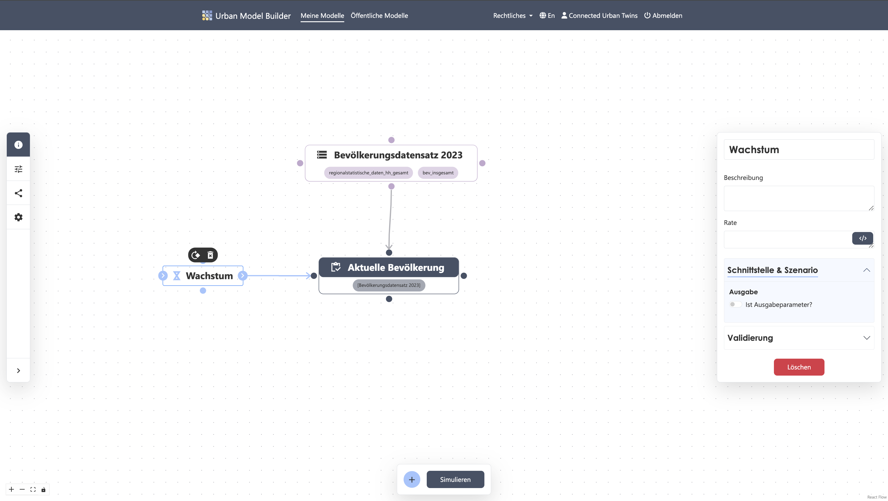

---
# 6. Variable "Birth Rate" create
✔︎ Add a variable and name it "Birth Rate"

✔︎ Set the value to ```0.0096```

✔︎ Connect the variable to the upper or lower node of the flow "Growth"
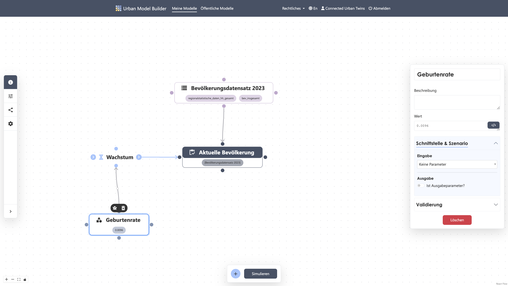

---
# 7. Equation in Inflow "Growth" create
✔︎ Connect the stock "Current Population" to the upper or lower node of the variable "Birth Rate"

✔︎ Multiply the values of ```[Birth Rate]```and ```[Current Population]```together by clicking the buttons under the value field to insert them
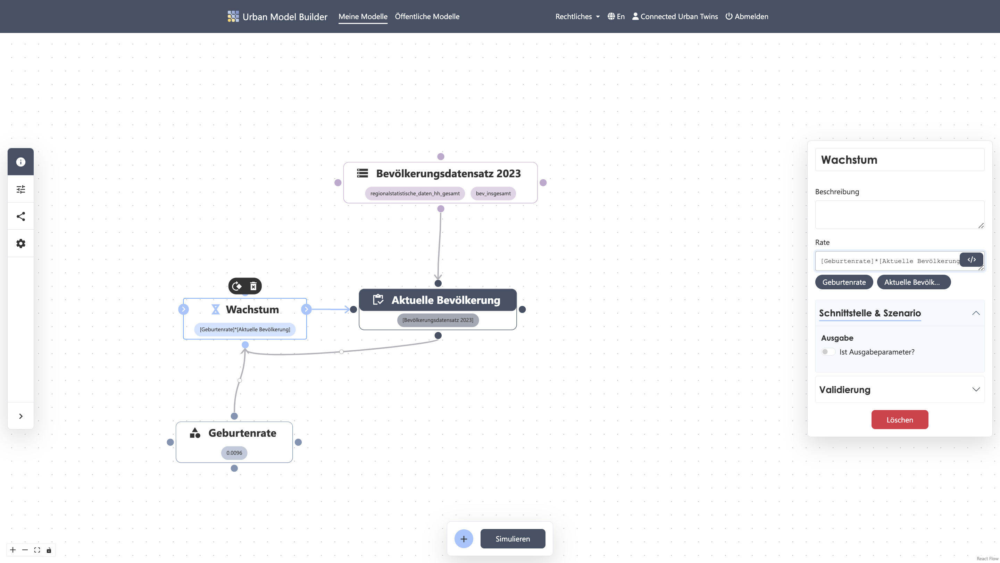

---
# 8. Outflow "Decrease" create
✔︎ Add a flow and name it "Decrease"

✔︎ Now connect a node of the stock "Current Population" to the input node of the flow 
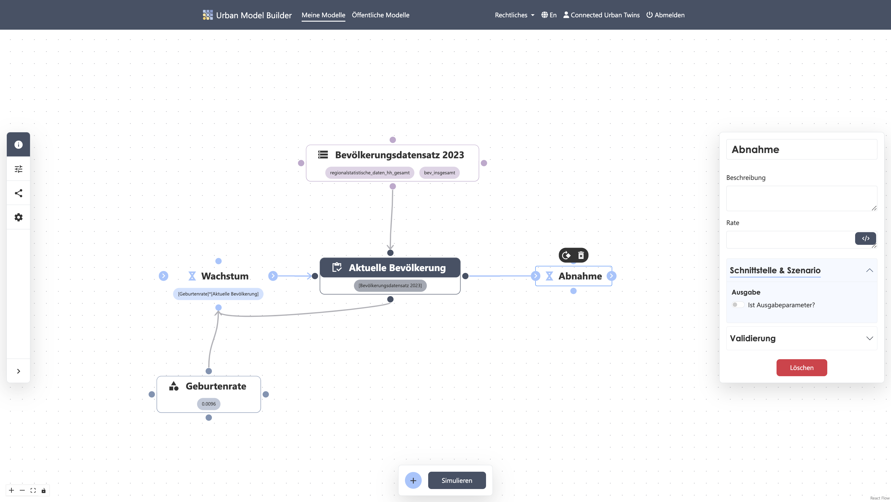

---
# 9. Variable "Death Rate" create
✔︎ Add a variable and name it "Death Rate"

✔︎ Set the value to ```0.01```

✔︎ Connect the variable to the upper or lower node of the flow "Decrease"
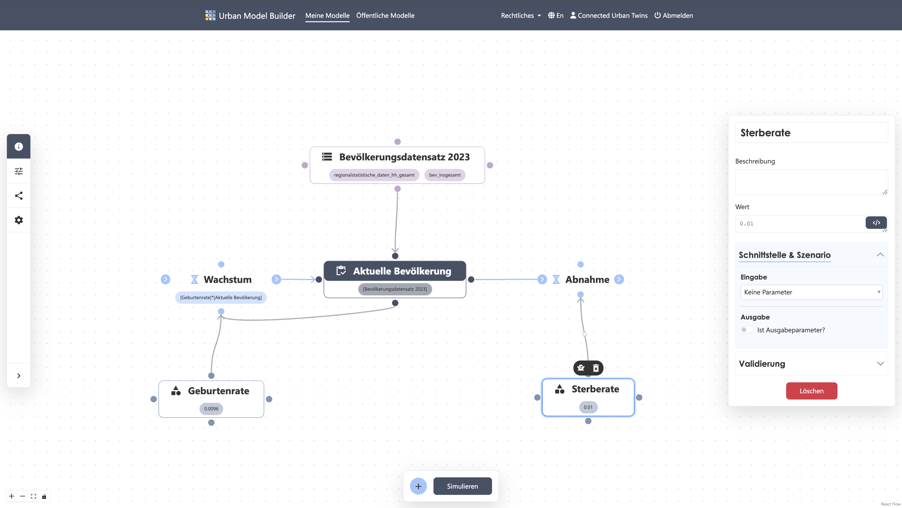

---
# 10. Equation in Outflow "Decrease" create
✔︎ Multiply the values of ```[Death Rate]```and ```[Current Population]```together by clicking the buttons under the value field to insert them
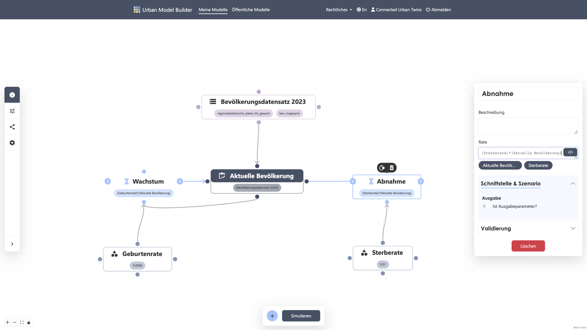

---
# 11. Simulation Settings
✔︎ Open the model settings in the sidebar 

✔︎ Set the values as follows:

Start: 0
Length: 50 
Interval: 5 
Unit: Years
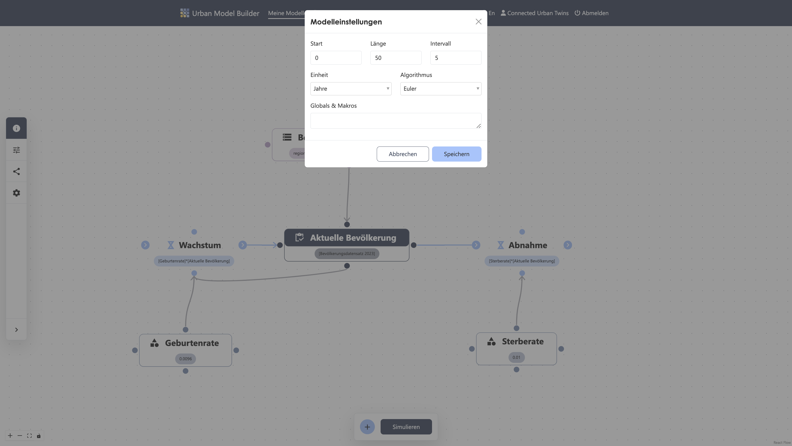

---
# 12. Start Simulation
✔︎ Start the simulation calculation by clicking the "Simulate" button in the active bar
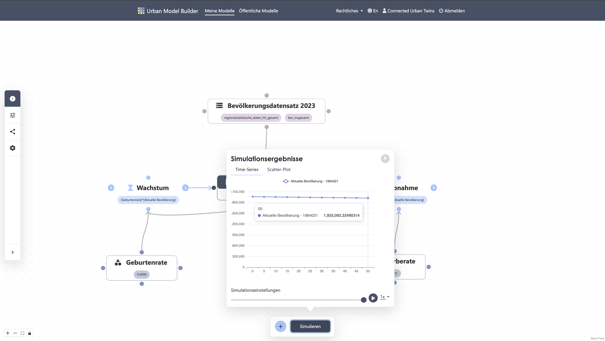

---
# 13. Test Scenario
✔︎ Vary the value of the variable "Birth Rate" by opening the parameter settings of this variable by clicking on it

✔︎ Set a slider under Interface and Scenario and set the following values:
Min:```0,0096```
Step:```0,001```
Max:```0,02```

✔︎ Under the scenario settings in the sidebar, you will now find a slider with which you can flexibly adjust and save the input values of the variable "Birth Rate"
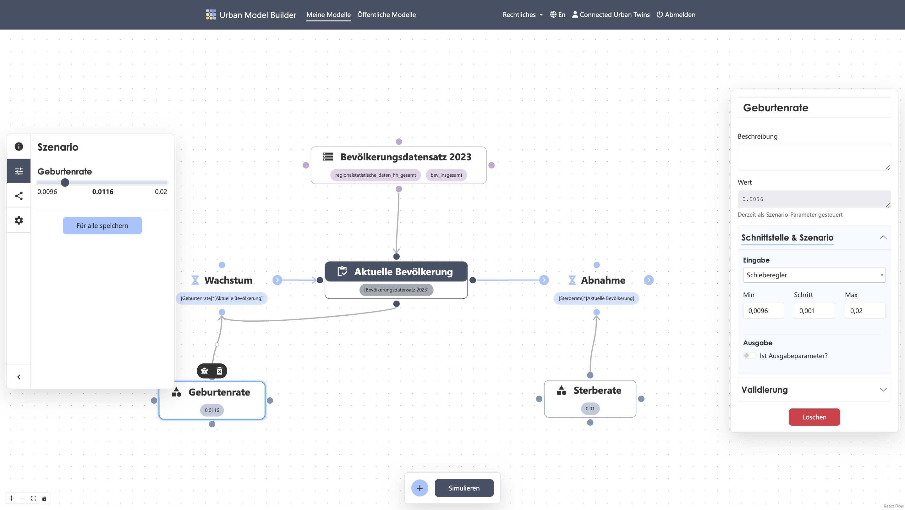

---
# 14. Start Simulation Again
✔︎ Check the impact of your variation of the variable "Birth Rate" on the "Current Population" and start the simulation again

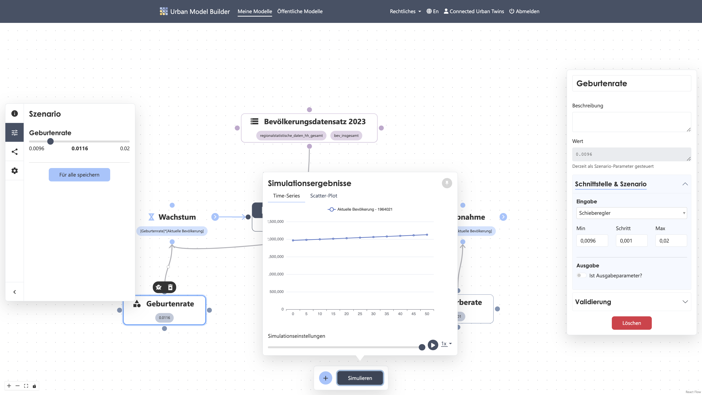

---
Congratulations, you have created your first System Dynamics model with API feature!


