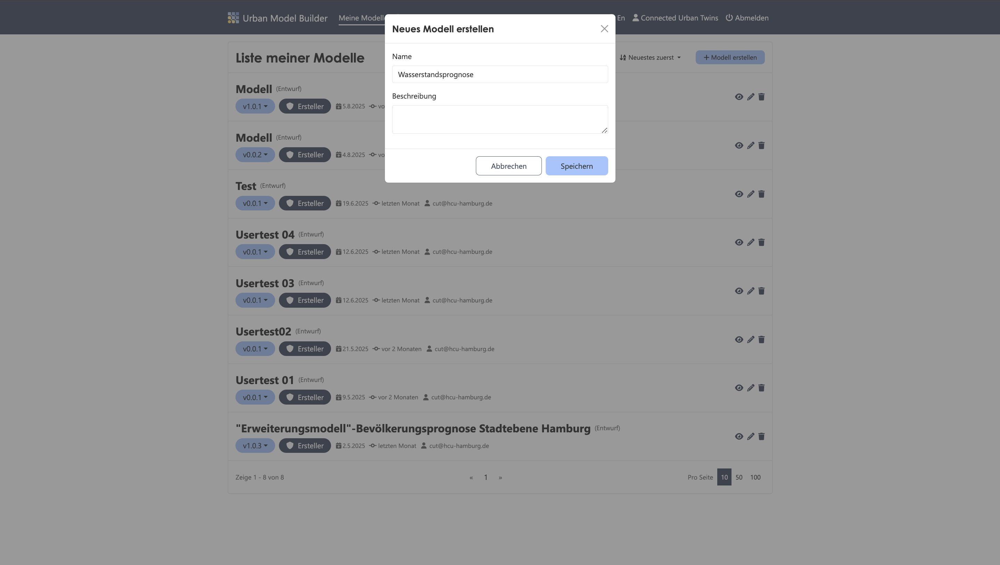
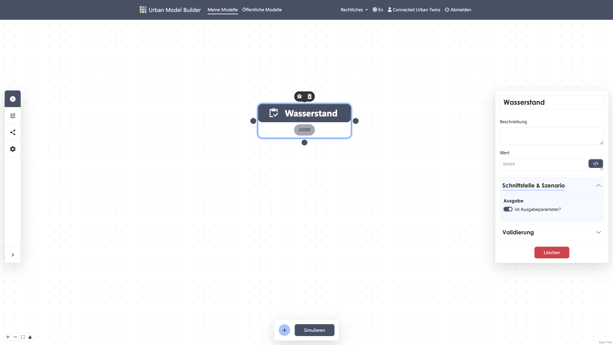
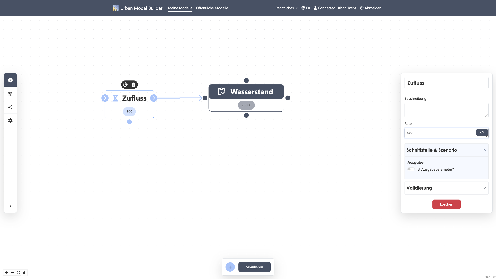
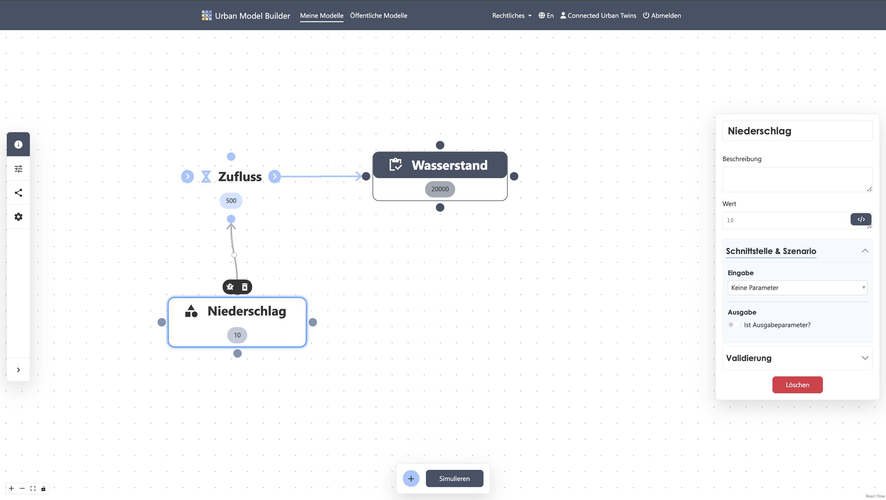
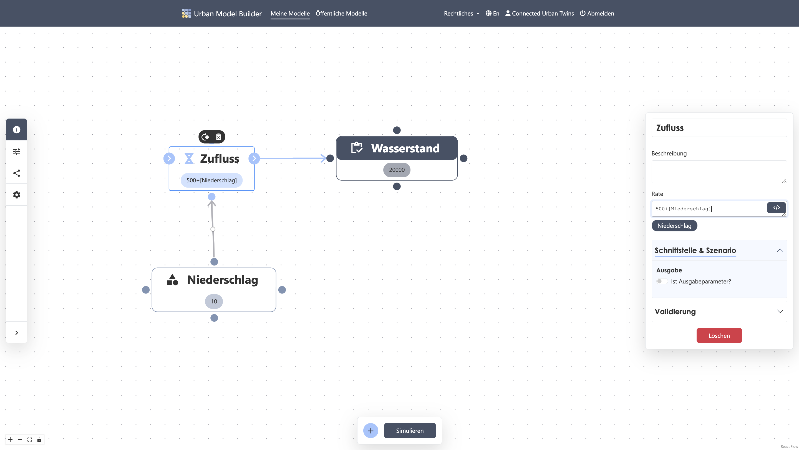
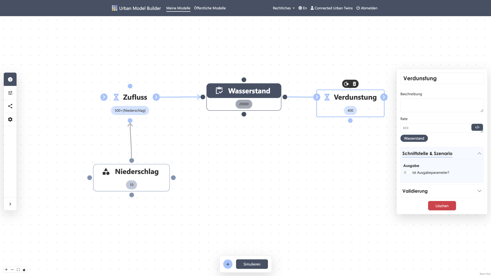
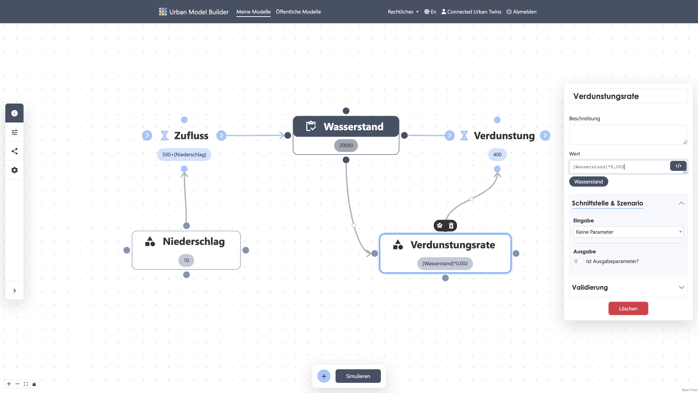
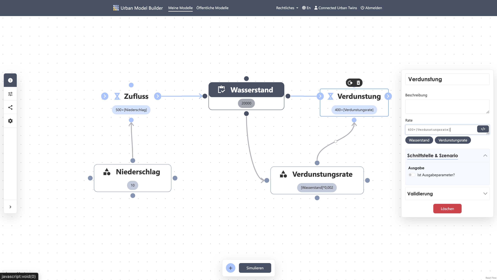
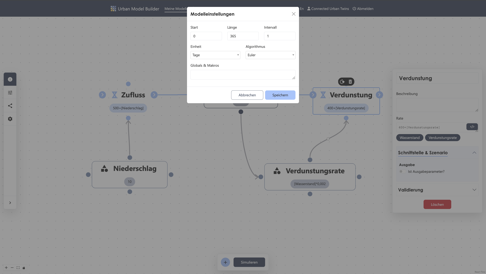
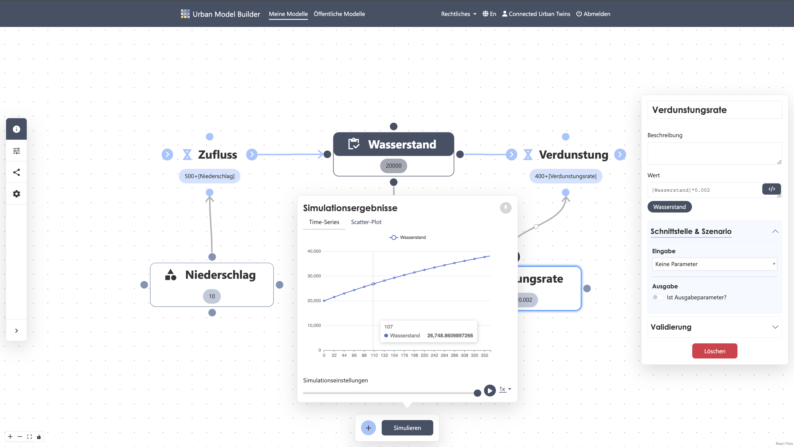

# System Dynamics Model

# Water Level with Inflow and Evaporation
Imagine you want to know how the water volume in a lake changes over time. Rain occasionally adds water, but some water also evaporates when there is sufficient sunlight. There are also constant inflows and outflows via small streams. The following step-by-step guide shows you how to build your first System Dynamics model in just a few steps!

---
# 1. Create a new model
✔︎ Create a new model and name it "Water Level Forecast"



---
# 2. Create stock "Water Level"
✔︎ Add a stock from the Activebar using the plus icon

✔︎ Click on the placed stock and name it "Water Level"

✔︎ Set a starting value, e.g., ```20000``` m<sup>3</sup>. If you want to add a unit, you can do so under the "Validation" tab in the primitive settings.

✔︎ Set the stock as an output parameter



---
# 3. Create inflow "Inflow"
✔︎ Add a flow and name it "Inflow"

✔︎ Set a constant value of ```500``` m<sup>3</sup> per day, e.g., from a stream. If you want to add a unit, use the "Validation" tab.

✔︎ Connect the output node of the flow to the stock

✔︎ Ensure the arrow points toward the stock



---
# 4. Create variable "Precipitation"
✔︎ Add a variable named "Precipitation"

✔︎ Set a constant value, e.g., ```10```<sup>3</sup> per day. Use the "Validation" tab for units.

✔︎ Connect the variable to the flow



---
# 5. Set equation for flow "Inflow"
✔︎ Open the parameters for the "Inflow" flow

✔︎ Add the "Precipitation" value to the stream inflow



---
# 6. Create outflow "Evaporation"
✔︎ Add another flow named "Evaporation"

✔︎ Set a constant value of ```400``` m<sup>3</sup> per day

✔︎ Connect the stock to the flow input

✔︎ Ensure the arrow points away from the stock



---
# 7. Create variable "Evaporation Rate"
✔︎ Add a variable named "Evaporation Rate"

✔︎ Set it dependent on water level, e.g., ```Water Level * 0.002``` (0.2% per day)

✔︎ Connect the variable to the "Evaporation" flow



---
# 8. Set equation for flow "Evaporation"
✔︎ Open the parameters for the "Evaporation" flow

✔︎ Add the "Evaporation Rate" to the stream outflow



---
# 9. Simulation settings
✔︎ Open model settings in the sidebar

✔︎ Set values as follows:

Start: 0  
Length: 365  
Interval: 1  
Unit: Days



---
# 10. Run simulation
✔︎ Start the simulation by clicking the "Simulate" button in the Activebar



Your first System Dynamics model is complete!
